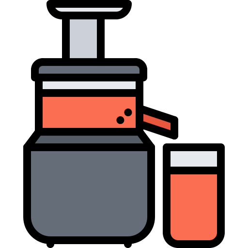
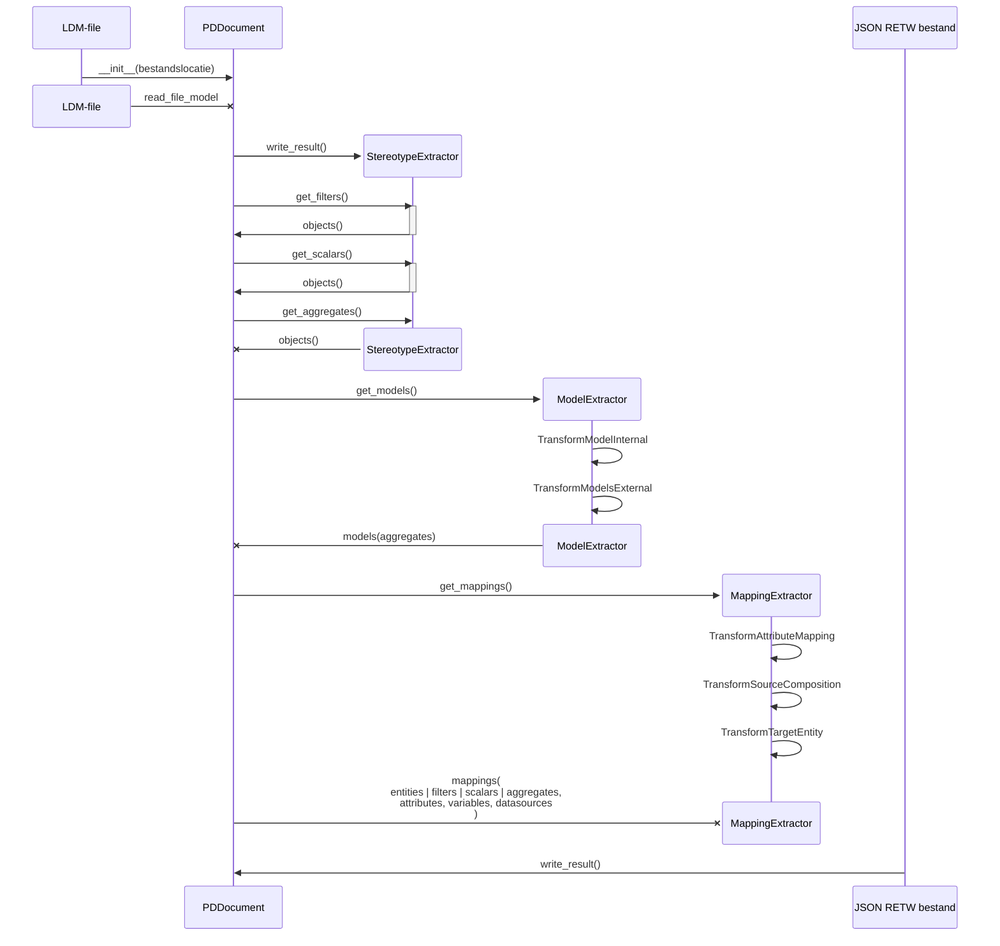
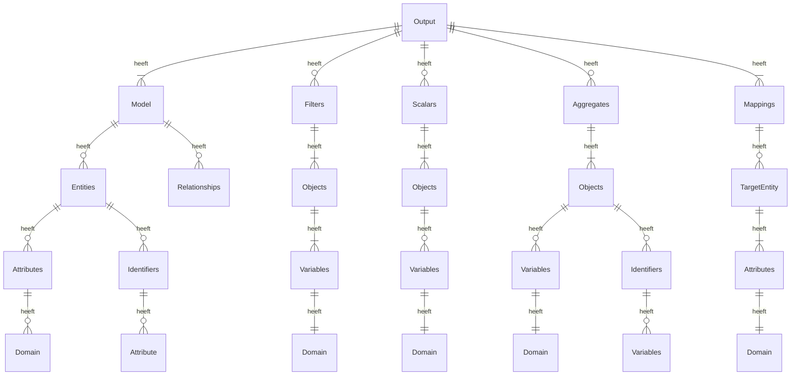
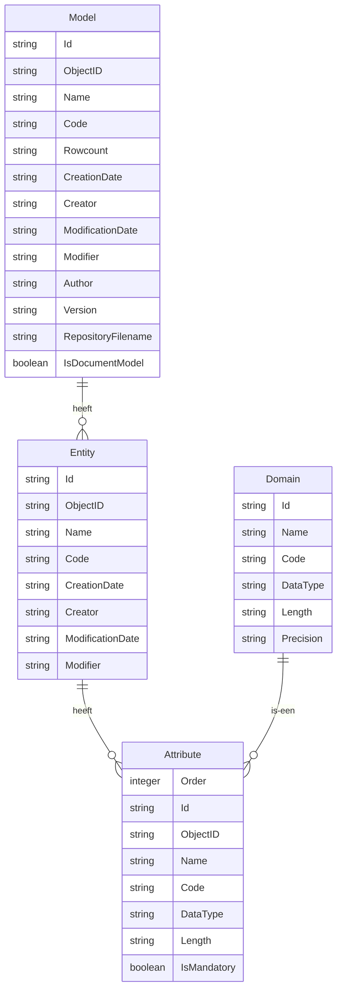
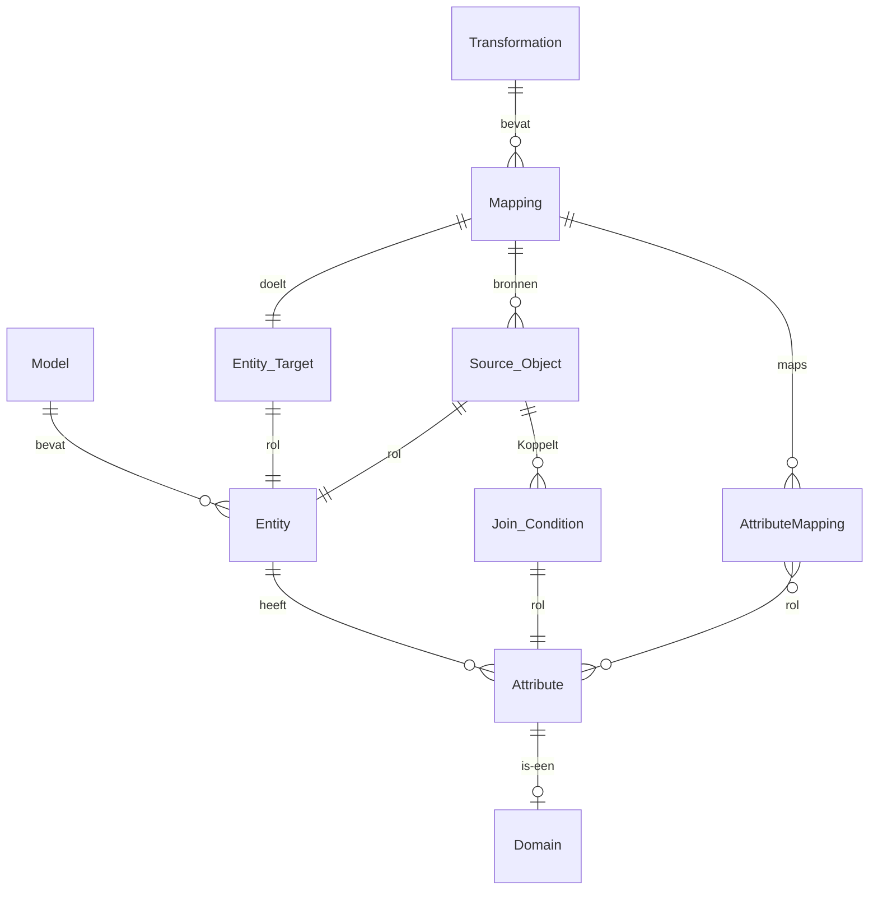

# Extractor

{ align=right width="90" }

Deze documentatie beschrijft het gebruik van het Python-package dat gegevens extraheert uit Power Designer-documenten. Power Designer wordt vaak gebruikt voor het modelleren van databases en gegevensstromen in ETL-processen.
Het doel van deze tool is om automatisch structuurinformatie en transformatiespecificaties uit Power Designer-modellen te halen en om te zetten naar een JSON-representatie. Deze JSON kan vervolgens gebruikt worden voor documentatie, kwaliteitscontrole of gegenereerde laadprogrammatuur.

De extractie ondersteunt informatie over:

* Tabellen en attributen (LDM/Logical Data Model),
* Relaties en domeinen,
* Mappings, joins en transformatie-logica.

Deze handleiding legt uit hoe je de extractor kunt gebruiken, hoe het JSON-bestand is opgebouwd, en geeft visuele modellen van de interne structuur.

## 🚀 Gebruik

De extractor-module bevindt zich in de map src/pd_extractor. Het startpunt is het bestand pd_document.py, waarin de klasse PDDocument wordt gedefinieerd. Deze klasse wordt geïnstantieerd met een bestandslocatie als parameter, waarna de functie write_result wordt gebruikt om de JSON-output te genereren.

```python title="Voorbeeld gebruik:"
from pathlib import Path

from pd_extractor import PDDocument

file_pd_model = "./etl_templates/input/CL_Relations_LDM_Test.ldm"
dir_output = "./etl_templates/output/"
file_json = dir_output + Path(path).file_pd_model + ".json"
document = PDDocument(file_pd_ldm=file_pd_model)
document.write_result(file_output=file_json)
```

## Belangrijke componenten

De volgende klassen spelen een belangrijke rol in het extractieproces:

* `PDDocument`, fungeert als de hoofdinterface voor het omzetten van Power Designer LDM-bestanden in een gestructureerd, machine-leesbaar formaat dat geschikt is voor verdere verwerking in datamodellering, DDL- en ETL-generatie workflows. Het abstraheert de complexiteit van het parsen en interpreteren van de LDM XML en biedt een overzichtelijke API voor downstream-tools en -processen.
* `StereotypeExtractor` is verantwoordelijk voor het extraheren en verwerken van specifieke typen objecten (filters, aggregaten en scalars) uit een Power Designer-document dat als een dictionary is gerepresenteerd. De extractie is gebaseerd op een opgegeven stereotype. De klasse verzorgt tevens het opschonen en transformeren van deze objecten en verzamelt gerelateerde domeingegevens.
    * `TransformStereotype` is verantwoordelijk voor....
* `ModelExtractor` is verantwoordelijk voor het extraheren en transformeren van relevante objecten uit een Power Designer Logical Data Model (LDM)-document. Het hoofddoel is om de inhoud van het LDM te parsen, interne en externe modellen, entiteiten, relaties, domeinen en datasources te identificeren en deze informatie voor te bereiden voor verdere verwerking, zoals ETL of lineage-analyse. De klasse maakt gebruik van twee transformatie-helpers (`TransformModelInternal` en `TransformModelsExternal`) om de specifieke structuren van interne en externe modellen te verwerken.
    * `TransformModelInternal` is verantwoordelijk voor het transformeren en opschonen van metadata uit PowerDesigner-modellen voor gebruik in DDL (Data Definition Language) en ETL (Extract, Transform, Load) generatie. De klasse breidt `ObjectTransformer` uit en biedt een reeks methoden om verschillende componenten van een PowerDesigner-model te verwerken, normaliseren en verrijken, zoals modellen, domeinen, datasources, entiteiten en relaties.
    * `TransformModelsExternal` is verantwoordelijk voor het transformeren en opschonen van modelgegevens — specifiek gericht op externe entiteiten in Power Designer-documenten. De klasse breidt `ObjectTransformer` uit en biedt methoden om model- en entiteitsgegevens te verwerken, verrijken en saneren voor gebruik in mapping-operaties.
* `MappingExtractor` is verantwoordelijk voor het extraheren van ETL (Extract, Transform, Load) mapping-specificaties uit een Power Designer Logical Data Model (LDM) dat gebruikmaakt van de CrossBreeze MDDE-extensie. De klasse verwerkt de ruwe modelgegevens, filtert irrelevante mappings eruit en transformeert de geëxtraheerde informatie naar een leesbaarder en gestructureerd formaat.
    * `TransformAttributeMapping` is verantwoordelijk voor het transformeren en verrijken van attributen-mappings, specifiek voor ETL (Extract, Transform, Load).
    * `TransformSourceComposition` is verantwoordelijk voor het transformeren, opschonen en verrijken van "source composition"-datastructuren die zijn geëxtraheerd uit Power Designer Logical Data Model (LDM)-documenten. Het hoofddoel is om complexe mapping- en compositiedata te verwerken en te normaliseren. Hierbij worden voorbeelddata verwijderd, relevante entiteiten, join-condities en scalar-condities geëxtraheerd en klaargemaakt voor verdere verwerking in ETL- of DDL-generatie.
    * `TransformTargetEntity` is verantwoordelijk voor het verwerken en verrijken van mapping-data die zijn geëxtraheerd uit Power Designer-documenten. Het hoofddoel is om mapping entries te transformeren door deze te associëren met hun doeltabellen en attributen.

## Sequentie diagram

In de onderstaande diagram is de flow van het extractieproces weergegeven.



## Veelgestelde vragen (FAQ)

❓ Ondersteunt de extractor meerdere modelversies van Power Designer?

Momenteel wordt enkel getest met Power Designer 16.7. Andere versies kunnen verschillen in XML-structuur, wat foutmeldingen kan veroorzaken.

❓ Moet ik een volledig fysiek model (PDM) hebben of volstaat een logisch model (LDM)?

De extractor is ontworpen voor logische modellen (LDM). Ondersteuning voor PDM’s is beperkt en kan later worden toegevoegd.

❓ Wordt het JSON-bestand automatisch gevalideerd?

Er is nog geen JSON-schema-validatie inbegrepen. Het is aanbevolen om het bestand visueel of met scripts te controleren.

❓ Kan ik ook alleen de transformaties extraheren?

Ja, mits de mapping-informatie aanwezig is in het LDM. Er is (nog) geen ondersteuning voor losse mapping-bestanden.

## Gegevensstructuur van de JSON-output

De JSON-output is opgebouwd rond gegevensobjecten voor modellen, entiteiten, attributen, relaties, transformaties, mappings, filters en functies. De JSON bevat twee hoofdonderdelen: een lijst met modellen en een lijst met transformaties. Op hoofdlijnen kan de output als volgt worden beschreven in de vorm van een [entiteit relatie diagram](https://nl.wikipedia.org/wiki/Entity-relationshipmodel):



In de rest van deze sectie wordt er meer detail ingevuld voor gegevensstructuur voor elk [model](#model-output) en voor elke [transformatie](#transformatie-output).

### Model output

De JSON-structuur die door de extractor wordt gegenereerd, volgt een gelaagd datamodel. Onderstaande diagram toont de belangrijkste objecten die de structuur van het logische datamodel beschrijven, zoals tabellen (entiteiten), kolommen (attributen), en domeinen (gegevenstypen). Deze structuur vormt de basis voor documentatie of verdere verwerking van het model.



### Transformatie output

Naast de beschrijving van het datamodel bevat de JSON ook informatie over transformaties. Deze transformaties geven aan hoe gegevens uit brontabellen gecombineerd worden, welke join-condities gelden, en hoe attributen gemapt worden naar doelstructuren. Het onderstaande klassendiagram toont de betrokken objecten zoals mappings, source objects, join-condities en de rol van attributen in deze transformaties.



## Class diagram voor de extractor

```mermaid
classDiagram
PDDocument: doel - Lezen model XML en wegschrijven Json Output
ModelExtractor: doel - extraheert alle blokken
ModelExtractor: uit XML <br> t.b.v. model aka DDL
%% TransformationExtractor: doel - extraheert alle blokken
%% TransformationExtractor: uit XML t.b.v. ETL
TransformModelInternal: doel - ophalen van bouwblokken
TransformModelInternal: entiteiten, attributen, domains
TransformModelInternal: van interne model
TransformModelsExternal: doel - ophalen van bouwblokken
TransformModelsExternal: entiteiten en attributen van
TransformModelsExternal: externe model
MappingExtractor: doel - extraheert mapping information
MappingExtractor: uit output TransformationExtractor
FilterExtractor: doel - extraheert filter informatie
FilterExtractor: uit output TransformationExtractor
ScalerExtractor: doel - extraheert scaler informatie
ScalerExtractor: uit output TransformationExtractor
TransformSource_Composition: doel - ophalen van bouw-
TransformSource_Composition: blokken t.b.v. composition
TransformTarget_Entity: doel - ophalen van bouwblokken
TransformTarget_Entity: t.b.v. doelentiteit
TransformAttribute_Mapping: doel - ophalen van bouwblokken
TransformAttribute_Mapping: t.b.v. attribuut mapping
TransformFilter: doel - ophalen van bouwblokken
TransformFilter: t.b.v. filter
TransformScaler: doel - ophalen van bouwblokken
TransformScaler: t.b.v. scaler
ObjectTransformer: doel - centrale plek voor
ObjectTransformer: herbruikbare functions
ModelExtractor: doel - extraheert alle blokken uit XML <br> t.b.v. model aka DDL
TransformationExtractor: doel - extraheert alle blokken uit XML t.b.v. ETL
TransformModelInternal: doel - ophalen van bouwblokken entiteiten, attributen, domains van interne model
TransformModelsExternal: doel - ophalen van bouwblokken entiteiten en attributen van externe model
MappingExtractor: doel - extraheert mapping information uit output TransformationExtractor
FilterExtractor: doel - extraheert filter informatie uit output TransformationExtractor
ScalerExtractor: doel - extraheert scaler informatie uit output TransformationExtractor
TransformSource_Composition: doel - ophalen van bouwblokken t.b.v. composition
TransformTarget_Entity: doel - ophalen van bouwblokken t.b.v. doelentiteit
TransformAttribute_Mapping: doel - ophalen van bouwblokken t.b.v. attribuut mapping
TransformFilter: doel - ophalen van bouwblokken t.b.v. filter
TransformScaler: doel - ophalen van bouwblokken t.b.v. scaler
ObjectTransformer: doel - centrale plek voor herbruikbare functions


    PDDocument *-- ModelExtractor

    PDDocument *-- TransformationExtractor

    ModelExtractor *-- TransformModelInternal
    ModelExtractor *-- TransformModelsExternal

    PDDocument *-- MappingExtractor
    PDDocument *-- FilterExtractor
    PDDocument *-- ScalerExtractor

    TransformationExtractor *-- MappingExtractor
    TransformationExtractor *-- FilterExtractor
    TransformationExtractor *-- ScalerExtractor

    MappingExtractor *-- TransformSource_Composition
    MappingExtractor *-- TransformTarget_Entity
    MappingExtractor *-- TransformAttribute_Mapping
    FilterExtractor *-- TransformFilter
    ScalerExtractor *-- TransformScaler
    TransformModelInternal <-- ObjectTransformer
    TransformModelsExternal <-- ObjectTransformer
    TransformSource_Composition <-- ObjectTransformer
    TransformTarget_Entity <-- ObjectTransformer
    TransformAttribute_Mapping <-- ObjectTransformer
    TransformFilter <-- ObjectTransformer
    TransformScaler <-- ObjectTransformer
```



## Mogelijke uitbreidingen

**Andere modeltypes**
Ondersteuning voor andere modeltypes, zoals PDM of gecombineerde modellen.

**JSON validatie**
Genereren van een JSON-schema om de structuur formeel te valideren.

**CLI functionaliteit**
Toevoegen van CLI-functionaliteit (command line interface) voor eenvoudiger gebruik zonder code.

**Versies vergelijken**
Mogelijkheid om veranderingen tussen modelversies te vergelijken.

## API referentie

### ::: src.pd_extractor.pd_document.PDDocument

---

### ::: src.pd_extractor.pd_stereotype_extractor.StereotypeExtractor

---

### ::: src.pd_extractor.pd_transform_stereotype.TransformStereotype

---

### ::: src.pd_extractor.pd_model_extractor.ModelExtractor

---

### ::: src.pd_extractor.pd_transform_model_internal.TransformModelInternal

---

### ::: src.pd_extractor.pd_transform_models_external.TransformModelsExternal

---

### ::: src.pd_extractor.pd_mapping_extractor.MappingExtractor

---

### ::: src.pd_extractor.pd_transform_attribute_mapping.TransformAttributeMapping

---

### ::: src.pd_extractor.pd_transform_source_composition.TransformSourceComposition

---

### ::: src.pd_extractor.pd_transform_target_entity.TransformTargetEntity

---
