# Genesis Orkestratie

{ align=right width="90" }

Het Python-script, ```main.py``` in de directory ```src/genesis```, dient als het startpunt voor de "Genesis" workflow-orkestrator. Het leest een [configuratiebestand](Configuration.md) uit, waarvan de locatie wordt meegegeven als commando argument, en start het workflowproces. De voornaamste functie is het beheren en uitvoeren van de stappen die in de configuratie zijn gedefinieerd, mogelijk inclusief uitrol-stappen.

## 🚀 Gebruik

* Zorg dat alle PowerDesigner-bestanden op de juiste locatie staan.
* Vul een YAML-configuratiebestand in op basis van het sjabloon ([zie voorbeeld](Configuration.md#voorbeeld-configuratiebestand)).
* Start het script met het pad naar het configuratiebestand: ```python main.py path/to/config.yaml```

Wanneer het main script wordt gestart worden de volgende stappen ondernomen:


## Verwerkingsvolgorde van orkestrator

Het orkestratie-proces doorloopt de volgende stappen:

```mermaid
sequenceDiagram
  participant G as Orchestrator
  participant CF as Configuratiebestand
  participant PD as Power Designer-bestand
  participant E as Extractor
  participant D as Afhankelijkheidschecker
  participant DG as Codegenerator

  G->CF: Leest configuratie
  loop Voor elk Power Designer-bestand
    G->E: extract(PD)
    E->PD: Leest gegevens
    E-->G: Geeft geëxtraheerde data terug
  end
  G->D: check_dependencies(geëxtraheerde data)
  D->D: Controleert afhankelijkheden
  D-->G: Retourneert eventuele problemen
  alt Geen problemen
    G->DG: generate_code(geëxtraheerde data)
    DG->DG: Genereert uitrolcode
  else Problemen gevonden
    G->G: Schrijft problemen weg naar bestand
    G->G: Stopt uitvoering
  end
```



## Class-diagram

In de klassediagram worden de details weergegeven van de Orchestrator klasse, meer details over de configuratieklassen zijn [hier](Documentation_Creation.md) te vinden.


## </> API referentie

### ::: src.genesis.orchestrator.Orchestrator
