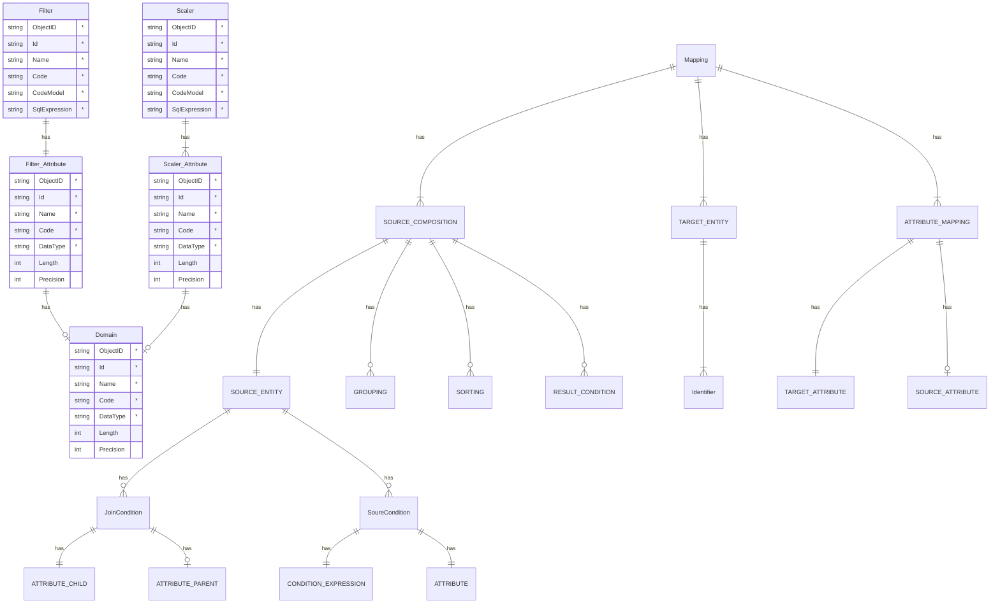

```mermaid
erDiagram
Filter{
        string ObjectID "*"  
        string Id "*" 
        string Name "*" 
        string Code "*" 
        string CodeModel "*" 
        string SqlExpression "*"
    }
Filter_Attribute{
        string ObjectID "*"  
        string Id "*" 
        string Name "*" 
        string Code "*" 
        string DataType "*" 
        int Length
        int Precision
    }
Scaler{
        string ObjectID "*"  
        string Id "*" 
        string Name "*" 
        string Code "*" 
        string CodeModel "*" 
        string SqlExpression "*"
    }
Scaler_Attribute{
        string ObjectID "*"  
        string Id "*" 
        string Name "*" 
        string Code "*" 
        string DataType "*" 
        int Length
        int Precision
    }
Domain{
        string ObjectID "*"  
        string Id "*" 
        string Name "*" 
        string Code "*" 
        string DataType "*" 
        int Length
        int Precision
}
    Filter ||--||  Filter_Attribute :has
    Filter_Attribute ||--o|  Domain:has
    Scaler||--|{ Scaler_Attribute:has
    Scaler_Attribute ||--o|  Domain:has

    Mapping ||--|{ SOURCE_COMPOSITION : has 
    Mapping ||--|{ TARGET_ENTITY :has
    Mapping ||--|{ ATTRIBUTE_MAPPING:has
    TARGET_ENTITY ||--|{ Identifier:has
    SOURCE_ENTITY ||--o{ JoinCondition:has
    SOURCE_ENTITY ||--o{ SoureCondition :has
    SoureCondition ||--|| CONDITION_EXPRESSION :has
    SoureCondition ||--|| ATTRIBUTE:has
    SOURCE_COMPOSITION ||--|| SOURCE_ENTITY:has
    ATTRIBUTE_MAPPING ||--|| TARGET_ATTRIBUTE :has
    ATTRIBUTE_MAPPING ||--o| SOURCE_ATTRIBUTE:has
    JoinCondition ||--|| ATTRIBUTE_CHILD:has
    JoinCondition ||--o| ATTRIBUTE_PARENT:has
    SOURCE_COMPOSITION ||--o{ GROUPING:has
    SOURCE_COMPOSITION ||--o{ SORTING:has
    SOURCE_COMPOSITION ||--o{ RESULT_CONDITION:has
```