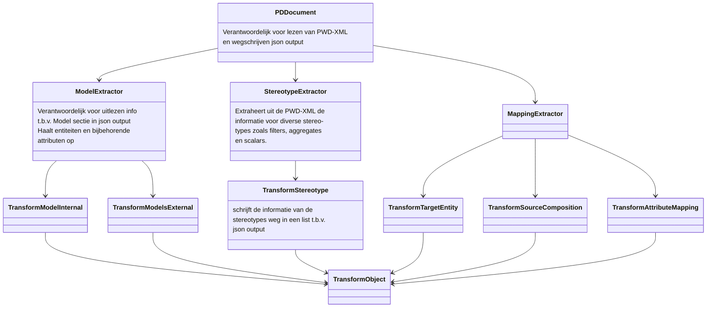
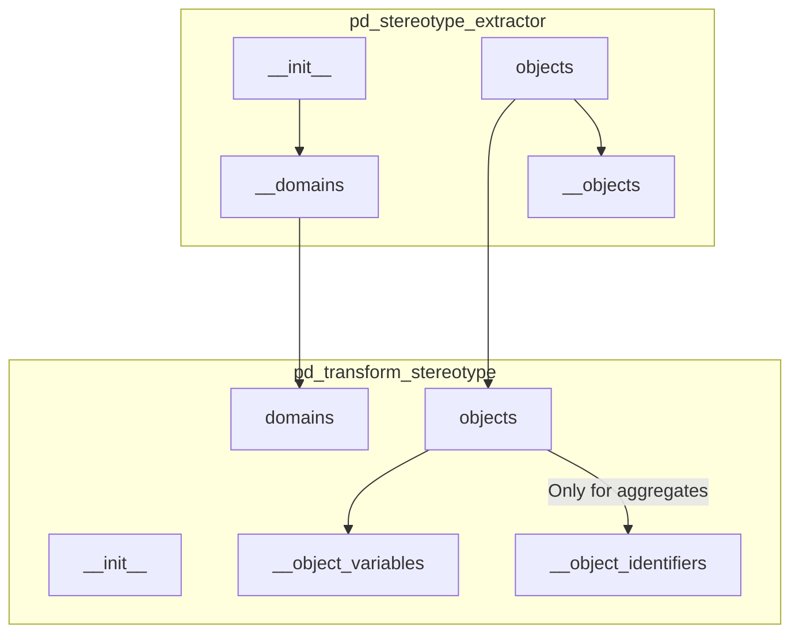
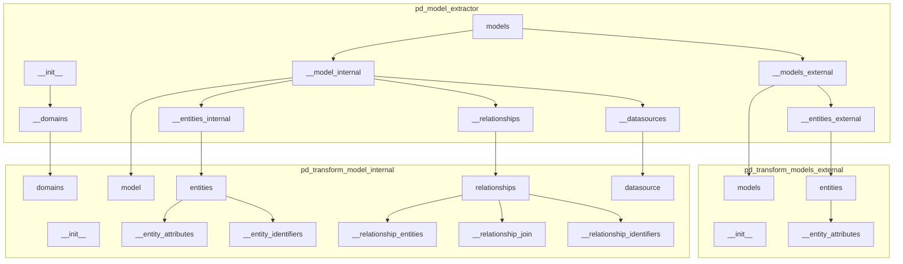
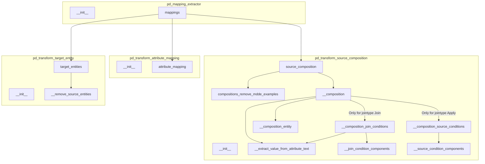
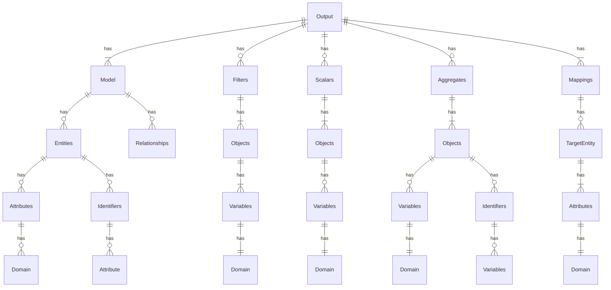

# Refactor RETW documentatie

## Refactor RETW: ClassDiagram

## Refactor RETW: functions

```mermaid
flowchart TB
    %%Alles in PD_Document
    pd_doc__init__[__init__]
    pd_doc_read_file_model[read_file_model]
    pd_doc_get_filters[get_filters]
    pd_doc_get_scalars[get_scalars]
    pd_doc_get_aggregates[get_aggregates]
    pd_doc_get_models[get_models]
    pd_doc_get_mappings[get_mappings]
    pd_doc__all_entities[__all_entities]
    pd_doc__all_filters[__all_filters]
    pd_doc__all_scalars[__all_scalars]
    pd_doc__all_aggregates[__all_aggregates]
    pd_doc__all_variables[__all_variables]
    pd_doc__all_attributes[__all_attributes]
    pd_doc__all_datasources[__all_datasources]
    pd_doc_write_result[write_result]
    pd_doc__serialize_datetime[__serialize_datetime]
    %%Alles in pd_stereotype_extractor
    pse__init__[__init__]
    pse_objects[objects]
    pse__objects[__objects]
    pse__domains[__domains]
    %%Alles in pd_transform_stereotype
    pst__init__[__init__]
    pst_domains[domains]
    pst_objects[objects]
    pst__object_variables[__object_variables]
    pst__object_identifiers[__object_identifiers]
    %%Alles in pd_model_extractor
    pme__init__[__init__]
    pme_models[models]
    pme__model_internal[__model_internal]
    pme__entities_internal[__entities_internal]
    pme__models_external[__models_external]
    pme__entities_external[__entities_external]
    pme__domains[__domains]
    pme__relationships[__relationships]
    pme__datasources[__datasources]
    %%Alles in pd_transform_model_internal
    ptmi__init__[__init__]
    ptmi_model[model]
    ptmi_domains[domains]
    ptmi_entities[entities]
    ptmi__entity_attributes[__entity_attributes]
    ptmi__entity_identifiers[__entity_identifiers]
    ptmi_relationships[relationships]
    ptmi__relationship_entities[__relationship_entities]
    ptmi__relationship_join[__relationship_join]
    ptmi__relationship_identifiers[__relationship_identifiers]
    ptmi_datasources[datasource]
    %%Alles in pd_transform_models_external
    ptme__init__[__init__]
    ptme_models[models]
    ptme_entities[entities]
    ptme__entity_attributes[__entity_attributes]
    %%Alles in pd_mapping_extractor
    pmae__init__[__init__]
    pmae_mappings[mappings]
    %%Alles in pd_transform_target_entity
    ptte__init__[__init__]
    ptte_target_entities[target_entities]
    ptte__remove_source_entities[__remove_source_entities]
    %%Alles in pd_transform_attribute_mapping
    ptam__init__[__init__]
    ptam_attribute_mapping[attribute_mapping]
    %%Alles in pd_transform_source_composition
    ptsc__init__[__init__]
    ptsc_source_composition[source_composition]
    ptsc_compositions_remove_mdde_examples[compositions_remove_mdde_examples]
    ptsc__composition[__composition]
    ptsc__composition_entity[__composition_entity]
    ptsc__composition_join_conditions[__composition_join_conditions]
    ptsc__join_condition_components[__join_condition_components]
    ptsc__extract_value_from_attribute_text[__extract_value_from_attribute_text]
    ptsc__composition_source_conditions[__composition_source_conditions]
    ptsc__source_condition_components[__source_condition_components]
    %%Alle links die over onderdelen heen gaan
    pd_doc_get_filters ----> pse_objects
    pd_doc_get_scalars ----> pse_objects
    pd_doc_get_aggregates ----> pse_objects
    pse_objects ----> pst_objects
    pse__domains --> pst_domains
    pd_doc_get_models ----> pme_models
    pme__model_internal --> ptmi_model
    pme__entities_internal --> ptmi_entities
    pme__domains --> ptmi_domains
    pme__relationships --> ptmi_relationships
    pme__datasources --> ptmi_datasources
    pme__models_external --> ptme_models
    pme__entities_external --> ptme_entities
    pd_doc_get_mappings ----> pmae_mappings
    pmae_mappings ----> ptte_target_entities
    pmae_mappings ----> ptam_attribute_mapping
    pmae_mappings ----> ptsc_source_composition
    subgraph PD_Document
    direction TB
    pd_doc__init__ --> pd_doc_read_file_model
    pd_doc_get_mappings --> pd_doc__all_entities
    pd_doc_get_mappings --> pd_doc__all_filters
    pd_doc_get_mappings --> pd_doc__all_scalars
    pd_doc_get_mappings --> pd_doc__all_aggregates
    pd_doc_get_mappings --> pd_doc__all_variables
    pd_doc_get_mappings --> pd_doc__all_attributes
    pd_doc_get_mappings --> pd_doc__all_datasources
    pd_doc_write_result --> pd_doc_get_filters
    pd_doc_write_result --> pd_doc_get_scalars
    pd_doc_write_result --> pd_doc_get_aggregates
    pd_doc_write_result --> pd_doc_get_models
    pd_doc_write_result --> pd_doc_get_mappings
    pd_doc_write_result --> pd_doc__serialize_datetime
    end
    subgraph pd_stereotype_extractor
    direction TB
    pse__init__ --> pse__domains
    pse_objects --> pse__objects
    pse__objects
    end
    subgraph pd_transform_stereotype
    direction TB
    pst__init__
    pst_objects --> pst__object_variables
    pst_objects -- Only for aggregates --> pst__object_identifiers
    pst_domains
    end
    subgraph pd_model_extractor
    direction TB
    pme__init__ --> pme__domains
    pme_models --> pme__model_internal
    pme_models --> pme__models_external
    pme__model_internal --> pme__entities_internal
    pme__model_internal --> pme__relationships
    pme__model_internal --> pme__datasources
    pme__models_external --> pme__entities_external
    end
    subgraph pd_transform_model_internal
    direction TB
    ptmi__init__
    ptmi_model
    ptmi_entities --> ptmi__entity_attributes
    ptmi_entities --> ptmi__entity_identifiers
    ptmi_domains
    ptmi_datasources
    ptmi_relationships --> ptmi__relationship_entities
    ptmi_relationships --> ptmi__relationship_join
    ptmi_relationships --> ptmi__relationship_identifiers
    end
    subgraph pd_transform_models_external
    direction TB
    ptme__init__
    ptme_models
    ptme_entities --> ptme__entity_attributes
    end
    subgraph pd_mapping_extractor
    direction TB
    pmae__init__
    pmae_mappings
    end
    subgraph pd_transform_target_entity
    direction TB
    ptte__init__
    ptte_target_entities --> ptte__remove_source_entities
    end
    subgraph pd_transform_attribute_mapping
    direction TB
    ptam__init__
    ptam_attribute_mapping
    end
    subgraph pd_transform_source_composition
    direction TB
    ptsc__init__
    ptsc_source_composition --> ptsc_compositions_remove_mdde_examples
    ptsc_source_composition --> ptsc__composition
    ptsc__composition --> ptsc__extract_value_from_attribute_text
    ptsc__composition --> ptsc__composition_entity
    ptsc__composition -- Only for jointype Join --> ptsc__composition_join_conditions
    ptsc__composition_join_conditions --> ptsc__extract_value_from_attribute_text
    ptsc__composition_join_conditions --> ptsc__join_condition_components
    ptsc__composition -- Only for jointype Apply --> ptsc__composition_source_conditions
    ptsc__composition_source_conditions --> ptsc__source_condition_components
    end
```

### Refactor RETW: functions PD_Document

```mermaid
flowchart TB
    %%Alles in PD_Document
    pd_doc__init__[__init__]
    pd_doc_read_file_model[read_file_model]
    pd_doc_get_filters[get_filters]
    pd_doc_get_scalars[get_scalars]
    pd_doc_get_aggregates[get_aggregates]
    pd_doc_get_models[get_models]
    pd_doc_get_mappings[get_mappings]
    pd_doc__all_entities[__all_entities]
    pd_doc__all_filters[__all_filters]
    pd_doc__all_scalars[__all_scalars]
    pd_doc__all_aggregates[__all_aggregates]
    pd_doc__all_variables[__all_variables]
    pd_doc__all_attributes[__all_attributes]
    pd_doc__all_datasources[__all_datasources]
    pd_doc_write_result[write_result]
    pd_doc__serialize_datetime[__serialize_datetime]
    %%Alle links die over onderdelen heen gaan
    pd_doc_get_filters ----> pse_objects
    pd_doc_get_scalars ----> pse_objects
    pd_doc_get_aggregates ----> pse_objects
    pd_doc_get_models ----> pme_models
    pd_doc_get_mappings ----> pmae_mappings
    subgraph PD_Document
    direction TB
    pd_doc__init__ --> pd_doc_read_file_model
    pd_doc_get_mappings --> pd_doc__all_entities
    pd_doc_get_mappings --> pd_doc__all_filters
    pd_doc_get_mappings --> pd_doc__all_scalars
    pd_doc_get_mappings --> pd_doc__all_aggregates
    pd_doc_get_mappings --> pd_doc__all_variables
    pd_doc_get_mappings --> pd_doc__all_attributes
    pd_doc_get_mappings --> pd_doc__all_datasources
    pd_doc_write_result --> pd_doc_get_filters
    pd_doc_write_result --> pd_doc_get_scalars
    pd_doc_write_result --> pd_doc_get_aggregates
    pd_doc_write_result --> pd_doc_get_models
    pd_doc_write_result --> pd_doc_get_mappings
    pd_doc_write_result --> pd_doc__serialize_datetime
    end
    subgraph PD_Stereotype_Extractor
    pse_objects[objects]
    end
    subgraph PD_Model_Extractor
    pme_models[Models]
    end
    subgraph PD_Mapping_Extractor
    pmae_mappings[Mappings]
    end
```

### Refactor RETW: functions stereotypes

### Refactor RETW: functions model

### Refactor RETW: functions mapping

## Models ERDiagram

