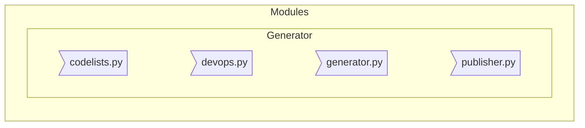
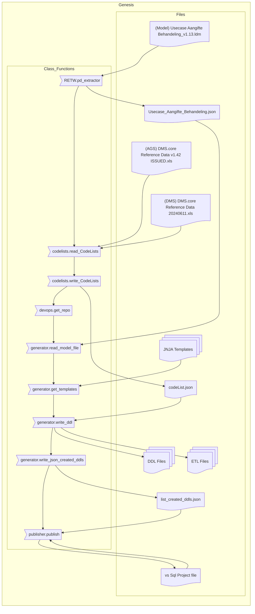

# Introduction 
The Generator Package contains code for 

```mermaid
graph LR
    codelists>codelists.py]
    devops>devops.py]
    generator>generator.py]
    publisher>publisher.py]

subgraph Modules
    subgraph Generator
        devops
        publisher
        generator
        codelists
    end
end
codelists ~~~ devops
devops ~~~ generator
generator ~~~ publisher

```

```mermaid
graph LR
    inAgs@{ shape: doc, label: "(AGS) DMS.core Reference Data v1.42 ISSUED.xls"}
    inDms@{ shape: doc, label: "(DMS) DMS.core Reference Data 20240611.xls"}
    inModel@{ shape: doc, label: "(Model) Usecase Aangifte Behandeling_v1.13.ldm"}
    ETL@{ shape: docs, label: "ETL Files" }
    DDL@{ shape: docs, label: "DDL Files" }

    outCodeList@{ shape: doc, label: "codeList.json"}
    outModel@{ shape: doc, label: "Usecase_Aangifte_Behandeling.json"}
    outDDL@{ shape: doc, label: "list_created_ddls.json"}

    templates@{ shape: docs, label: "JNJA Templates" }
    vsSqlPrj@{ shape: doc, label: "vs Sql Project file"}

    pd_extractor>RETW.pd_extractor]
    readCodeLists>codelists.read_CodeLists]
    writeCodeLists>codelists.write_CodeLists]
    get_repo>devops.get_repo]
    read_model_file>generator.read_model_file]
    get_templates>generator.get_templates]
    write_ddl>generator.write_ddl]
    write_json_created_ddls>generator.write_json_created_ddls]
    publish>publisher.publish]


subgraph Genesis
    subgraph Files
        templates
        inAgs
        inDms
        inModel
        outCodeList
        outModel
        DDL
        ETL
        outDDL
        vsSqlPrj
    end
    subgraph Class_Functions
        pd_extractor
        readCodeLists
        writeCodeLists
        get_repo
        read_model_file
        get_templates
        write_ddl
        write_json_created_ddls
        publish
    end

end

  Files ~~~  Class_Functions 
  inModel ~~~ outModel
  outModel ~~~ inAgs
  inAgs ~~~ inDms

inAgs --> readCodeLists
inDms --> readCodeLists
writeCodeLists --> outCodeList
outCodeList --> write_ddl
inModel --> pd_extractor
write_json_created_ddls--> outDDL
outDDL --> publish
pd_extractor --> outModel
outModel --> read_model_file
templates --> get_templates
write_ddl --> DDL
write_ddl --> ETL
vsSqlPrj --> publish
publish --> vsSqlPrj

pd_extractor --> readCodeLists
readCodeLists --> writeCodeLists
writeCodeLists --> get_repo
get_repo --> read_model_file
read_model_file --> get_templates
get_templates --> write_ddl
write_ddl --> write_json_created_ddls
write_json_created_ddls --> publish

``` 
