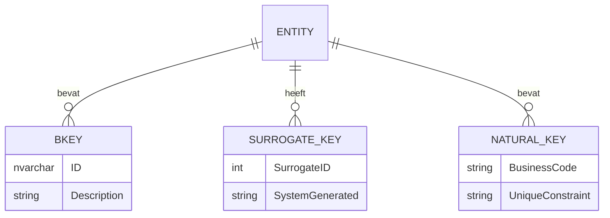
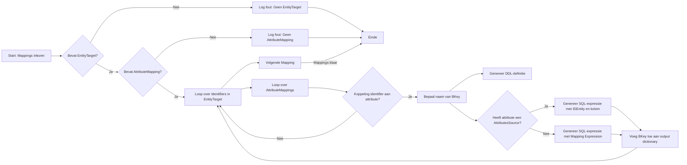

# Business keys
{ align=right width="90" }

## Achtergrond: Het "Bag of Keys"-principe in Data Warehousing

Voor Genesis hebben we ervoor gekozen het **"bag of keys"**-principe te gebruiken. Dit werwijst naar het gebruik van meerdere primaire en vreemde sleutels binnen een datamodel. Deze benadering is ontworpen om **data-integriteit**, **prestatie** en **modelleerflexibiliteit** te verbeteren, vooral bij grote en complexe datasets.

### Waarom een "bag of keys" gebruiken?

🔐 **Data-integriteit**
Door relaties tussen tabellen expliciet vast te leggen via sleutels wordt referentiële integriteit afgedwongen. Dit voorkomt fouten zoals verweesde records en inconsistenties in de gegevens.

⚡ **Prestatie**
Indexen op primaire en vreemde sleutels versnellen query’s aanzienlijk. In datawarehouses, waar datasets vaak groot zijn, is dit essentieel voor snelle data-analyse.

🧩 **Modellering en flexibiliteit**
Een "bag of keys" biedt ruimte voor evoluerende datastructuren. Hierdoor kunnen wijzigingen in het bronsysteem eenvoudiger worden opgevangen zonder bestaande modellen te breken.

🔄 **Flexibele data-integratie**
Surrogaat-sleutels maken het makkelijker om bronnen te combineren.

🕒 **Ondersteuning voor historiek**
Surrogaat-sleutels maken versiebeheer van gegevens mogelijk

### Surrogaat- en natuurlijke sleutels

* **Surrogaat-sleutels**: Kunstmatige, systeemgegenereerde sleutels zonder zakelijke betekenis. Deze zorgen voor stabiliteit in de sleutelstructuur en zijn geschikt voor historische tracking.
* **Natuurlijke sleutels**: Sleutels met zakelijke betekenis (zoals klantnummer of e-mailadres). Vaak gebruikt in combinatie met surrogaat-sleutels voor extra context en controle.

### Bag of Keys in het datamodel



## Genereren van Business Keys (BKeys)

In het ETL-proces worden **Business Keys (BKeys)** gebruikt om unieke entiteiten in de brondata te identificeren. Deze BKeys worden gegenereerd op basis van identifiers die zijn gedefinieerd in het datamodel (RETW-output) en worden toegevoegd aan zowel de entiteitdefinities (DDL) als de bronviews.

### Doel

Het doel van deze stap is om voor elke entiteit een consistente, unieke en herleidbare sleutel te genereren op basis van de beschikbare attributen in het bronsysteem. Deze sleutel:

* wordt opgeslagen als kolom `...BKey`,
* is samengesteld uit een prefix van de `DataSource` en één of meerdere kolomwaarden uit de bron,
* wordt als `nvarchar(200)` gedefinieerd in de doelstructuur,
* ondersteunt zowel primaire als alternatieve identifiers.

### Verwerking en Logica

De BKeys worden gegenereerd via de functie [`_collect_identifiers(mappings: dict)`](#src.generator.generator.DDLGenerator._collect_identifiers). Deze verwerkt alle mappings in het model en extraheren van de identifiers gebeurt als volgt:

1. **Identificatie van een Identifier**

    * Elke entiteit kan één of meerdere identifiers bevatten, waaronder precies één primaire.
    * Voor de naamgeving van de BKey wordt het `EntityCode` gebruikt bij primaire identifiers, anders het `Code`-attribuut van de identifier.

2. **Generatie van BKey-definitie voor de entiteit (DDL)**

    * Elke BKey wordt als volgt gedefinieerd:

        ```sql
        [<EntityCode>BKey] nvarchar(200) NOT NULL
        ```

    * Bijvoorbeeld:

        ```sql
        [CustomerBKey] nvarchar(200) NOT NULL
        ```

3. **Opbouw van de BKey in de bronview**
    * De waarde wordt samengesteld met behulp van de `DataSource` en een of meer attributen van de bron:
    * Indien afkomstig van een ander entiteit (`AttributesSource`), dan:

        ```sql
        [CustomerBKey] = 'CRM' + '-' + CAST(Customer.[CustomerNumber] AS NVARCHAR(50))
        ```

    * Indien gebaseerd op een directe expressie:

        ```sql
        [CustomerBKey] = 'CRM' + '-' + LOWER(CustomerCode)
        ```

4. **Foutafhandeling**

    * Als een mapping geen identifiers bevat, of geen attribute mappings bevat, wordt dit gelogd als fout.

#### Grafische weergave verwerking BKeys



### Resultaat

De functie retourneert een dictionary met voor elke identifier:

| Key                          | Omschrijving                                          |
| ---------------------------- | ----------------------------------------------------- |
| `IdentifierID`               | Unieke ID van de identifier                           |
| `IdentifierName`             | Naam van de identifier (zoals gedefinieerd)           |
| `IdentifierCode`             | Code (unieke naam) van de identifier                  |
| `EntityId`                   | De entiteit waartoe de identifier behoort             |
| `EntityCode`                 | De code van de entiteit                               |
| `IsPrimary`                  | Boolean die aangeeft of dit de primaire identifier is |
| `IdentifierStringEntity`     | DDL-definitie voor het toevoegen van de BKey-kolom    |
| `IdentifierStringSourceView` | SQL-expressie voor opbouw van de BKey-waarde          |

### Voorbeeldoutput

```json
{
  "123": {
    "IdentifierID": "123",
    "IdentifierName": "CustomerNumber",
    "IdentifierCode": "CustNum",
    "EntityId": "456",
    "EntityCode": "Customer",
    "IsPrimary": true,
    "IdentifierStringEntity": "[CustomerBKey] nvarchar(200) NOT NULL",
    "IdentifierStringSourceView": "[CustomerBKey] = 'CRM' + '-' + CAST(Customer.[CustomerNumber] AS NVARCHAR(50))"
  }
}
```

## Vervangen van technische keys door business keys

In de klasse `DDLEntities` wordt de methode [`__replace_entity_keys_with_bkeys`](#src.generator.ddl_entities.DDLEntities.__replace_entity_keys_with_bkeys) gebruikt om technische sleutels in entiteiten te vervangen door zogeheten *Business Keys (BKeys)*. Dit is een belangrijke stap in de voorbereiding van het genereren van DDL-code, waarbij de nadruk ligt op begrijpelijke, stabiele sleutels voor gegevensintegratie.

### Doel

De methode vervangt alle identifier-kolommen in een entiteit met gegenereerde Business Key-definities, op basis van eerder verzamelde identifierinformatie. Hierbij worden de oorspronkelijke attributen die overeenkomen met deze identifiers verwijderd uit de lijst van attributen, om duplicatie te voorkomen.

### Signatuur

```python
def __replace_entity_keys_with_bkeys(self, entity: dict, identifiers: dict) -> dict:
```

### Parameters

* `entity (dict)`: Een entiteitobject met een lijst van identifiers en attributen.
* `identifiers (dict)`: Een mapping van identifier-id’s naar metadata en bijbehorende BKey-definities. Dit wordt doorgaans gegenereerd door de methode `_collect_identifiers`.

### Werking

1. De methode doorloopt alle identifiers van een entiteit.
2. Voor elke identifier:

   * Indien aanwezig in `identifiers`, wordt de corresponderende BKey-definitie (`IdentifierStringEntity`) toegevoegd aan de entiteit.
   * De originele naam van de identifier wordt bijgehouden zodat bijbehorende attributen kunnen worden verwijderd.
3. Vervolgens worden alle attributen die overeenkomen met de identifiers verwijderd uit de attributenlijst van de entiteit.
4. De entiteit wordt bijgewerkt met:

   * Een nieuwe lijst `Identifiers` die alleen de BKey-definities bevat.
   * Een aangepaste lijst `Attributes` zonder dubbele kolommen.

### Voorbeeld

Als een entiteit `Customer` een technisch attribuut `CustomerID` had dat als primaire sleutel fungeerde, wordt dit vervangen door een nieuwe kolom `CustomerBKey` met een gegenereerde string zoals:

```sql
[CustomerBKey] nvarchar(200) NOT NULL
```

En de oorspronkelijke `CustomerID` wordt verwijderd uit de attributenlijst van de entiteit.

### Resultaat

Een entiteit waarin alle sleutelkolommen zijn vervangen door BKey-definities, en waarin de oorspronkelijke (technische) sleutelattributen zijn verwijderd om consistentie en leesbaarheid te garanderen bij het genereren van DDL-code.

## API referentie

### ::: src.generator.generator.DDLGenerator._collect_identifiers

### ::: src.generator.ddl_entities.DDLEntities.__replace_entity_keys_with_bkeys
