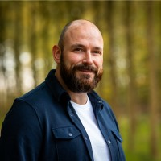

# Developers

{ align=right width="90" }

Ons development team bestaat uit gedreven specialisten met ieder hun eigen expertise, maar allen met de focus op het data domein. Samen realiseren ze schaalbare, betrouwbare en toekomstgerichte software-oplossingen.

## Ina van Dijk

* **Rol**: Modelleur
* **Expertise**: Processen, Data modelling, SQL, Python
* **LinkedIn**: [sara-vries](https://github.com/sara-vries)

## Anil Dipai
{ align=left width="80" }

* **Rol**: Lead Developer
* **Expertise**: ...
* **[LinkedIn](https://www.linkedin.com/in/anil-dipai-3a4a096/)**

## Mathijs Frencken
{ align=left width="80" }

* **Rol**: Lead Developer
* **Expertise**: ...
* **[LinkedIn](https://www.linkedin.com/in/mathijsfrencken/)**

## Youri-Tristan Jongejan
{ align=left width="80" }

* **Rol**: ...
* **Expertise**: ...
* **[LinkedIn](https://www.linkedin.com/in/youritristanjongejan/)**

## Avinash Kalicharan
{ align=left width="80" }

* **Rol**: ...
* **Expertise**: ...
* **[LinkedIn](https://www.linkedin.com/in/avinashkalicharan/)**

## Mijcke Peek
{ align=left width="80" }

* **Rol**: Lead Developer
* **Expertise**: ...
* **[LinkedIn](https://www.linkedin.com/in/mijckepeek/)**

## Jeroen Poll
{ align=left width="80" }

* **Rol**: Lead Developer
* **Expertise**: ...
* **[LinkedIn](https://www.linkedin.com/in/jeroenpoll/)**

## Mark Zwart
{ align=left width="80" }

* **Rol**: Genesis Developer, Product Owner
* **Expertise**: Angular, TypeScript, SCSS
* **[LinkedIn](https://www.linkedin.com/in/markzwart76/)**, **[Github](https://github.com/mark-me)**
