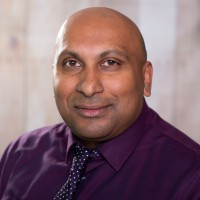
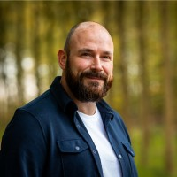

# Developers

{ align=right width="90" }

Ons Genesis development team bestaat uit gedreven specialisten met een focus op het data domein en een gedeelde passie voor Model Driven Data Engineering ([MDDE](https://en.wikipedia.org/wiki/Model-driven_engineering)) waarmee ze schaalbare, betrouwbare en toekomstgerichte informatie-oplossingen ontwikkelen.

## Ina van der Plas

* **Rol**: Modelleur
* **Expertise**: Processen, Data modelling, SQL, Python
* **[LinkedIn](https://github.com/sara-vries)**

## Anil Dipai

{ align=left width="110" }

* **Rol**: Developer
* **Expertise**: ...
* **[LinkedIn](https://www.linkedin.com/in/anil-dipai-3a4a096/)**

## Mathijs Frencken

{ align=left width="110" }

* **Rol**:
* **Expertise**: Modelleur
* **[LinkedIn](https://www.linkedin.com/in/mathijsfrencken/)**

## Youri-Tristan Jongejan

{ align=left width="110" }

* **Rol**: Developer
* **Expertise**: ...
* **[LinkedIn](https://www.linkedin.com/in/youritristanjongejan/)**

## Avinash Kalicharan

{ align=left width="110" }

* **Rol**: Developer
* **Expertise**: ...
* **[LinkedIn](https://www.linkedin.com/in/avinashkalicharan/)**

## Mijcke Peek

{ align=left width="110" }

* **Rol**: Developer
* **Expertise**: ...
* **[LinkedIn](https://www.linkedin.com/in/mijckepeek/)**

## Jeroen Poll

{ align=left width="110" }

* **Rol**: Developer
* **Expertise**: ...
* **[LinkedIn](https://www.linkedin.com/in/jeroenpoll/)**

## Mark Zwart

{ align=left width="110" }

* **Rol**: Developer, Product Owner
* **Expertise**: Python, SQL, R, Machine Learning, Docker
* **[LinkedIn](https://www.linkedin.com/in/markzwart76/)**, **[GitHub](https://github.com/mark-me)**
