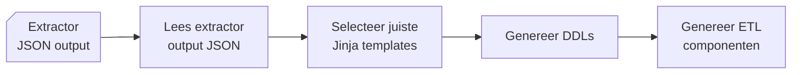
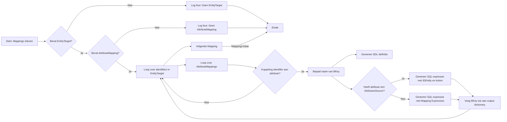
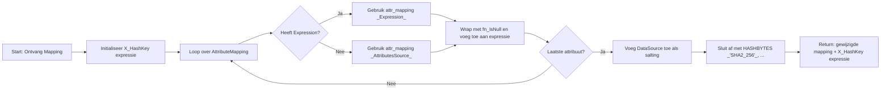

# Generator

{ align=right width="90" }

Deze documentatie beschrijft de structuur, werking en samenhang van componenten in de Generator package in Genesis. De Generator is verantwoordelijk voor het genereren van de code die de tabellen van de modellen implementeert en genereert de code voor de views, stored procedures en data inserts t.b.v. het ETL proces.



## Belangrijke componenten

* **`DDLGenerator`** fungeert als een centrale component voor de vertaling van JSON-modeldata naar database-artefacten, met name voor ETL- en DDL-processen. Het maakt gebruik van templates om platform-specifieke SQL-scripts te genereren en zorgt ervoor dat gegenereerde artefacten worden gedocumenteerd voor latere verwerking in DevOps-pijplijnen.

    * Input:
        * Neemt een dictionary van parameters aan, zoals paden, template-informatie en uitvoerlocaties.
    * Output:
        * De gegenereerde DDL- en ETL-bestanden worden georganiseerd in submappen per entiteit, view of post-deployment script.

---

## Afhankelijkheden

* **[`Jinja2`](https://jinja.palletsprojects.com/en/stable/):** Voor het renderen van SQL-templates.
* **([`Polars`](https://pola.rs/))** Voor het inlezen van de Excel-bestanden met codelijsten (in `CodeList`).
* **[`sqlparse`/`sqlfluff`](https://sqlfluff.com/):** Voor het formatteren en linten van gegenereerde SQL-scripts.
* **[`Pathlib`](https://docs.python.org/3/library/pathlib.html):** Voor platformonafhankelijk padbeheer.

---

## Genereren DDL en ETL

De Generator, genereert DDL en Post-Deploy bestanden en kopieert deze ook de ETL die nodig is om de data te kunnen verwerken. De doel architectuur / platform wordt bepaald aan de hand van een parameter.
De generator gaat neemt aan dat er een deployment (Git) repository op een lokale schijf aanwezig is, zodat de gegenereerde bestanden hier kunnen worden weggeschreven. Deze locatie is opgenomen in de ```config.yml``` onder de tag: ```vs_project_folder```.
De Git interactie gebeurt in de module ```devops.py``` en zal hier niet verder worden behandeld.

Omdat de ELT en DDL per platform / doel architectuur afwijkt, is deze in een sub folder geplaatst met de naam van het platform. Tijdens onze eerste uitrol kennen wij alleen nog maar de [Synapse Dedicated Pool](https://learn.microsoft.com/en-us/azure/synapse-analytics/sql-data-warehouse/sql-data-warehouse-overview-what-is) als platform, vandaar dat er nog geen andere platformen zijn uitgewerkt.

### ETL Templates

De ETL scripts maken deel uit van de Genesis generator en zijn opgeslagen in de folder: ``` ./etl_templates/src/generator/mdde_scripts/ {PLATFORM} / {** OPTIONEEL SCHEMA} ```.
Voor de Synapse Dedicated Pool zijn hier de ```Procedures``` , ```Functies``` en ```Tabellen``` opgeslagen.

Op basis van je Python-code kan ik een stuk documentatie schrijven waarin wordt uitgelegd hoe de **business keys (BKeys)** worden gegenereerd. Hieronder vind je een voorstel in Markdown-stijl, dat je kunt opnemen in je documentatie.

---

## Genereren van Business Keys (BKeys)

In het ETL-proces worden **Business Keys (BKeys)** gebruikt om unieke entiteiten in de brondata te identificeren. Deze BKeys worden gegenereerd op basis van identifiers die zijn gedefinieerd in het datamodel (RETW-output) en worden toegevoegd aan zowel de entiteitdefinities (DDL) als de bronviews.

### Doel

Het doel van deze stap is om voor elke entiteit een consistente, unieke en herleidbare sleutel te genereren op basis van de beschikbare attributen in het bronsysteem. Deze sleutel:

* wordt opgeslagen als kolom `...BKey`,
* is samengesteld uit een prefix van de `DataSource` en één of meerdere kolomwaarden uit de bron,
* wordt als `nvarchar(200)` gedefinieerd in de doelstructuur,
* ondersteunt zowel primaire als alternatieve identifiers.

### Verwerking en Logica

De BKeys worden gegenereerd via de functie `_collect_identifiers(mappings: dict)`. Deze verwerkt alle mappings in het model en extraheren van de identifiers gebeurt als volgt:

1. **Identificatie van een Identifier**

    * Elke entiteit kan één of meerdere identifiers bevatten, waaronder precies één primaire.
    * Voor de naamgeving van de BKey wordt het `EntityCode` gebruikt bij primaire identifiers, anders het `Code`-attribuut van de identifier.

2. **Generatie van BKey-definitie voor de entiteit (DDL)**

    * Elke BKey wordt als volgt gedefinieerd:

        ```sql
        [<EntityCode>BKey] nvarchar(200) NOT NULL
        ```

    * Bijvoorbeeld:

        ```sql
        [CustomerBKey] nvarchar(200) NOT NULL
        ```

3. **Opbouw van de BKey in de bronview**
    * De waarde wordt samengesteld met behulp van de `DataSource` en een of meer attributen van de bron:
    * Indien afkomstig van een ander entiteit (`AttributesSource`), dan:

        ```sql
        [CustomerBKey] = 'CRM' + '-' + CAST(Customer.[CustomerNumber] AS NVARCHAR(50))
        ```

    * Indien gebaseerd op een directe expressie:

        ```sql
        [CustomerBKey] = 'CRM' + '-' + LOWER(CustomerCode)
        ```

4. **Foutafhandeling**

    * Als een mapping geen identifiers bevat, of geen attribute mappings bevat, wordt dit gelogd als fout.

#### Grafische weergave verwerking BKeys



### Resultaat

De functie retourneert een dictionary met voor elke identifier:

| Key                          | Omschrijving                                          |
| ---------------------------- | ----------------------------------------------------- |
| `IdentifierID`               | Unieke ID van de identifier                           |
| `IdentifierName`             | Naam van de identifier (zoals gedefinieerd)           |
| `IdentifierCode`             | Code (unieke naam) van de identifier                  |
| `EntityId`                   | De entiteit waartoe de identifier behoort             |
| `EntityCode`                 | De code van de entiteit                               |
| `IsPrimary`                  | Boolean die aangeeft of dit de primaire identifier is |
| `IdentifierStringEntity`     | DDL-definitie voor het toevoegen van de BKey-kolom    |
| `IdentifierStringSourceView` | SQL-expressie voor opbouw van de BKey-waarde          |

### Voorbeeldoutput

```json
{
  "123": {
    "IdentifierID": "123",
    "IdentifierName": "CustomerNumber",
    "IdentifierCode": "CustNum",
    "EntityId": "456",
    "EntityCode": "Customer",
    "IsPrimary": true,
    "IdentifierStringEntity": "[CustomerBKey] nvarchar(200) NOT NULL",
    "IdentifierStringSourceView": "[CustomerBKey] = 'CRM' + '-' + CAST(Customer.[CustomerNumber] AS NVARCHAR(50))"
  }
}
```

## Genereren van `X_HashKey` voor Change Detection

Bij het laden van entiteiten in het datawarehouse wordt gebruikgemaakt van een `X_HashKey` om te bepalen of een record is gewijzigd sinds de vorige laadronde. Deze sleutel wordt opgebouwd op basis van alle attributen van de bronentiteit en wordt toegevoegd aan de views die door het ETL-proces worden gebruikt.

### Functieomschrijving

De Python-functie `__build_x_hashkey(mapping)` genereert een SQL-expressie voor de `X_HashKey` door:

1. Alle attributen in de mapping te verwerken.
2. Voor elk attribuut een `fn_IsNull(...)`-expressie te maken om `NULL`-waarden te voorkomen.
3. De waarden samen te voegen met `CONCAT(...)`.
4. De gegenereerde string te hashen met `HASHBYTES('SHA2_256', ...)`.

Deze hash wordt vervolgens gebruikt om vast te stellen of een rij in de bron is veranderd ten opzichte van de eerder geladen versie.

### Voorbeeld SQL-uitdrukking

Een gegenereerde expressie zou eruit kunnen zien als:

```sql
[X_HashKey] = HASHBYTES('SHA2_256', CONCAT(
    DA_MDDE.fn_IsNull(CustomerID),
    DA_MDDE.fn_IsNull(Name),
    DA_MDDE.fn_IsNull(Address),
    'CRM')) -- DataSource als salting factor
```

### Doel `X_Hashkeys`

* **Change Detection**: Door de hashwaarde te vergelijken met die van een eerder geladen versie, kan het systeem bepalen of een rij moet worden geüpdatet.
* **Efficiëntie**: Vergelijken op een enkele kolom (`X_HashKey`) is veel efficiënter dan veld-voor-veld vergelijking.
* **Consistency**: Gebruik van `fn_IsNull(...)` zorgt ervoor dat `NULL`-waarden altijd op consistente wijze worden verwerkt.

### Visueel overzicht van `X_HashKey`-generatie



---

## API referentie

### ::: src.generator.generator.DDLGenerator

### ::: src.generator.generator.TemplateType

---

### ::: src.generator.ddl_entities.DDLEntities

---

### ::: src.generator.ddl_base.DDLGeneratorBase

---

### ::: src.generator.ddl_views_source.DDLSourceViews

---

### ::: src.generator.ddl_views_source_aggr.DDLSourceViewsAggr

---

### ::: src.generator.ddl_views_base.DDLViewBase
