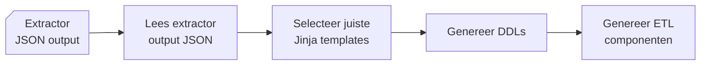
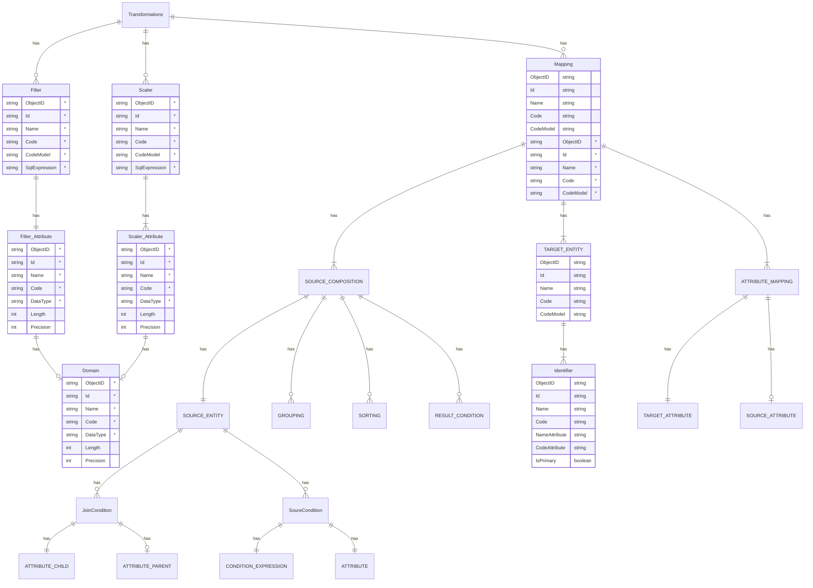
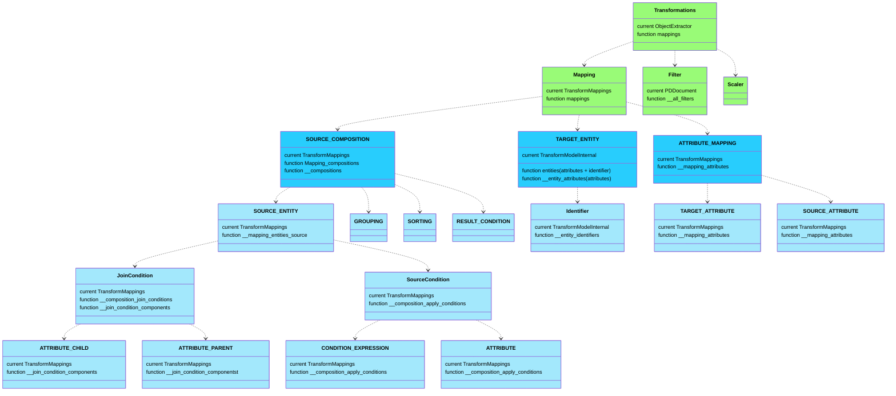
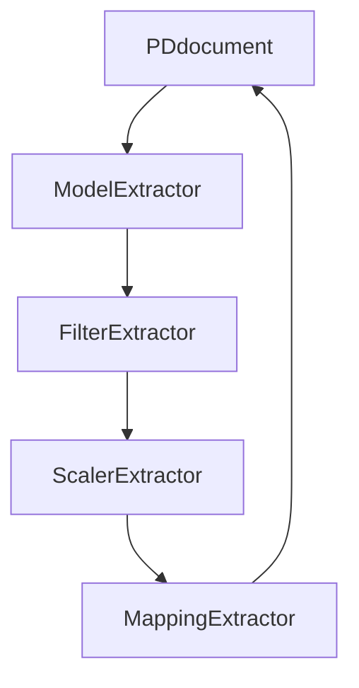

# Generator

{ align=right width="90" }

Deze documentatie beschrijft de structuur, werking en samenhang van componenten in de Generator package in Genesis. De Generator is verantwoordelijk voor het genereren van de code die de tabellen van de modellen implementeert en genereert de code voor de views, stored procedures en data inserts t.b.v. het ETL proces.



## Belangrijke componenten

* **`DDLGenerator`** fungeert als een centrale component voor de vertaling van JSON-modeldata naar database-artefacten, met name voor ETL- en DDL-processen. Het maakt gebruik van templates om platform-specifieke SQL-scripts te genereren en zorgt ervoor dat gegenereerde artefacten worden gedocumenteerd voor latere verwerking in DevOps-pijplijnen.
    * Input:
        * Neemt een dictionary van parameters aan, zoals paden, template-informatie en uitvoerlocaties.
        * Initieert de interne status, waaronder een uitvoer-volgregistratie (`dict_created_ddls`).
    * Output:
        * De gegenereerde DDL- en ETL-bestanden worden georganiseerd in submappen per entiteit, view of post-deployment script.
        * Een JSON-bestand (`generated_ddls.json`) biedt een overzicht van alle gegenereerde bestanden, gecategoriseerd per type.
* **`CodeList`** is verantwoordelijk voor het lezen, transformeren en exporteren van codelijstdata. De focus ligt op het standaardiseren van data uit verschillende bronsystemen ("DMS" en "AGS") en het opslaan van de verzamelde data in een JSON-formaat voor verdere verwerking door andere componenten in het systeem.
* **`DDLPublisher`** is verantwoordelijk voor het programmatisch bijwerken van een Visual Studio SQL-projectbestand (`.sqlproj`) door nieuwe SQL-bestanden, mappen en post-deployment scripts toe te voegen die elders in het systeem zijn gegenereerd. De centrale klasse, `DDLPublisher`, leest een JSON-bestand dat de gegenereerde DDL-bestanden beschrijft en werkt het projectbestand bij om ervoor te zorgen dat het project synchroon blijft met de gegenereerde artefacten. De ouput is:
    * JSON Outputbestand (`generated_ddls.json`):
        * Dit bestand bevat een overzicht van alle gegenereerde DDL-bestanden, gestructureerd per map of type.
        * Wordt gebruikt als input voor de `publish()`-methode om nieuwe bestanden en mappen te identificeren.
    * SQL Projectbestand (`.sqlproj`):
        * De `.sqlproj`-structuur wordt bijgewerkt met nieuwe bestanden en post-deployment scripts.
        * Problematische XML-elementen, zoals dubbele `<VisualStudioVersion>`-elementen, worden verwijderd om laadfouten in Visual Studio te voorkomen.

## Afhankelijkheden

* **[`Jinja2`](https://jinja.palletsprojects.com/en/stable/):** Voor het renderen van SQL-templates.
* **([`Polars`](https://pola.rs/))** Voor het inlezen van de Excel bestanden met codelijsten (in `CodeList`).
* **[`sqlparse`/`sqlfluff`](https://sqlfluff.com/):** Voor het formatteren en linten van gegenereerde SQL-scripts.
* **[`Pathlib`](https://docs.python.org/3/library/pathlib.html):** Voor platformonafhankelijke padbeheer.

## Genereren DDL en ETL

De Generator, genereert DDL en Post-Deploy bestanden en kopieert deze ook de ETL die nodig is om de data te kunnen verwerken. De doel architectuur / platform wordt bepaald aan de hand van een parameter.
De generator gaat neemt aan dat er een deployment (Git) repository op een lokale schijf aanwezig is, zodat de gegenereerde bestanden hier kunnen worden weggeschreven. Deze locatie is opgenomen in de ```config.yml``` onder de tag: ```vs_project_folder```.
De Git interactie gebeurt in de module ```devops.py``` en zal hier niet verder worden behandeld.

Omdat de ELT en DDL per platform / doel architectuur afwijkt, is deze in een sub folder geplaatst met de naam van het platform. Tijdens onze eerste uitrol kennen wij alleen nog maar de [Synapse Dedicated Pool](https://learn.microsoft.com/en-us/azure/synapse-analytics/sql-data-warehouse/sql-data-warehouse-overview-what-is) als platform, vandaar dat er nog geen andere platformen zijn uitgewerkt.

### ETL Templates

De ETL scripts maken deel uit van de Genesis generator en zijn opgeslagen in de folder: ``` ./etl_templates/src/generator/mdde_scripts/ {PLATFORM} / {** OPTIONEEL SCHEMA} ```.
Voor de Synapse Dedicated Pool zijn hier de ```Procedures``` , ```Functies``` en ```Tabellen``` opgeslagen.

### DDL MDDE PostDeploy

De Post-Deploy script worden gemaakt, om stam- en config-tabellen te vullen, na een release.
In de huidige opzet is voor de ```DataCenter``` Dedicated pool een Visual Studio Solution aangemaakt met daarin een SQL Project per laag. Per SQL project is er maximaal één Post-Deploy bestand aanwezig waarin code of referenties gezet kunnen worden die na de release worden uitgevoerd.
Voor de Centrale laag is dit het project ```3. Central Layer``` en het Post-Deploy bestand is te vinden in de folder:  ```./CentralLayer/PostDeployment/PostDeploy.sql```
Het script moet als basis de volgende code bevatten:

```
PRINT N'Running PostDeploy:'
PRINT N'Running PostDeploy: ..\DA_MDDE\PostDeployment\PostDeploy_Dates.sql'
:r ..\DA_MDDE\PostDeployment\PostDeploy_Dates.sql
PRINT N'Running PostDeploy: ..\DA_Central\PostDeployment\PostDeploy_MetaData_Calendar.sql'
:r ..\DA_MDDE\PostDeployment\PostDeploy_MetaData_Calendar.sql
PRINT N'Running PostDeploy: ..\DA_MDDE\PostDeployment\PostDeploy_MetaData_Config_CodeList.sql'
:r ..\DA_MDDE\PostDeployment\PostDeploy_MetaData_Config_CodeList.sql
```

### DDL MDDE PostDeploy Config

Per model dat door de generator heen gaat, zal er een PostDeploy bestand gemaakt worden die zorgt dat de config tabel voorzien kan worden met de mappingen die geladen moeten worden.
Deze functie ```write_dll()``` roept een private functie aan ```__write_ddl_MDDE_PostDeploy_Config()``` die van het aangeboden model de PostDeploy genereerd en klaarzet in de PostDeploy folder in de MDDE folder.
De opbouw ziet zo uit:
```. CentralLayer\DA_MDDE\PostDeployment\PostDeploy_MetaData_Config_{ MODEL CODE }.sql```
Naast dat het bestand aangemaakt is, zal er een referentie moeten worden opgenomen in het master PostDeploy script.
Deze zal voorzien worden van 2 extra regels:

```
PRINT N'Running PostDeploy: ..\DA_MDDE\PostDeployment\PostDeploy_MetaData_Config_{ MODEL CODE }.sql
:r ..\DA_MDDE\PostDeployment\PostDeploy_MetaData_Config_{ MODEL CODE }.sql.sql
```

De PRINT zorgt ervoor dat er in de Azure Replease Pipeline zichtbaar is welke scripts er uitgevoerd wordt.

### ONDERSTAANDE NOG DOORLOPEN

Toont de relaties tussen de verschillende entiteiten zoals Filters, Scalers, Mappings en Target Entities.



## ERDiagram incl. notes



## Vertaling ERDiagram naar Classes

### FlowDiagram



## API referentie

### ::: src.generator.generator.DDLGenerator

---

### ::: src.generator.publisher.DDLPublisher

---

### ::: src.generator.devops.DevOpsHandler

---

### ::: src.generator.codelists.CodeList
