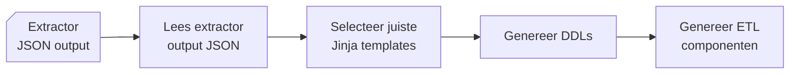

# Generator

{ align=right width="90" }

Deze documentatie beschrijft de structuur, werking en samenhang van componenten in de Generator package in Genesis. De Generator is verantwoordelijk voor het genereren van de code die de tabellen van de modellen implementeert en genereert de code voor de views, stored procedures en data inserts t.b.v. het ETL proces.



## Belangrijke componenten

* **`DDLGenerator`** fungeert als een centrale component voor de vertaling van JSON-modeldata naar database-artefacten, met name voor ETL- en DDL-processen. Het maakt gebruik van templates om platform-specifieke SQL-scripts te genereren en zorgt ervoor dat gegenereerde artefacten worden gedocumenteerd voor latere verwerking in DevOps-pijplijnen.
    * Input:
        * Neemt een dictionary van parameters aan, zoals paden, template-informatie en uitvoerlocaties.
    * Output:
        * De gegenereerde DDL- en ETL-bestanden worden georganiseerd in submappen per entiteit, view of post-deployment script.

## Afhankelijkheden

* **[`Jinja2`](https://jinja.palletsprojects.com/en/stable/):** Voor het renderen van SQL-templates.
* **([`Polars`](https://pola.rs/))** Voor het inlezen van de Excel-bestanden met codelijsten (in `CodeList`).
* **[`sqlparse`/`sqlfluff`](https://sqlfluff.com/):** Voor het formatteren en linten van gegenereerde SQL-scripts.
* **[`Pathlib`](https://docs.python.org/3/library/pathlib.html):** Voor platformonafhankelijk padbeheer.

## Genereren DDL en ETL

De Generator, genereert DDL en Post-Deploy bestanden en kopieert deze ook de ETL die nodig is om de data te kunnen verwerken. De doel architectuur / platform wordt bepaald aan de hand van een parameter.
De generator gaat neemt aan dat er een deployment (Git) repository op een lokale schijf aanwezig is, zodat de gegenereerde bestanden hier kunnen worden weggeschreven. Deze locatie is opgenomen in de ```config.yml``` onder de tag: ```vs_project_folder```.
De Git interactie gebeurt in de module ```devops.py``` en zal hier niet verder worden behandeld.

Omdat de ELT en DDL per platform / doel architectuur afwijkt, is deze in een sub folder geplaatst met de naam van het platform. Tijdens onze eerste uitrol kennen wij alleen nog maar de [Synapse Dedicated Pool](https://learn.microsoft.com/en-us/azure/synapse-analytics/sql-data-warehouse/sql-data-warehouse-overview-what-is) als platform, vandaar dat er nog geen andere platformen zijn uitgewerkt.

### ETL Templates

De ETL scripts maken deel uit van de Genesis generator en zijn opgeslagen in de folder: ``` ./etl_templates/src/generator/mdde_scripts/ {PLATFORM} / {** OPTIONEEL SCHEMA} ```.
Voor de Synapse Dedicated Pool zijn hier de ```Procedures``` , ```Functies``` en ```Tabellen``` opgeslagen.

## API referentie

### ::: src.generator.generator.DDLGenerator

### ::: src.generator.generator.TemplateType

---

### ::: src.generator.ddl_entities.DDLEntities

---

### ::: src.generator.ddl_base.DDLGeneratorBase

---

### ::: src.generator.ddl_views_source.DDLSourceViews

---

### ::: src.generator.ddl_views_source_aggr.DDLSourceViewsAggr

---

### ::: src.generator.ddl_views_base.DDLViewBase
