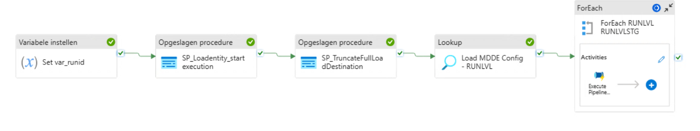
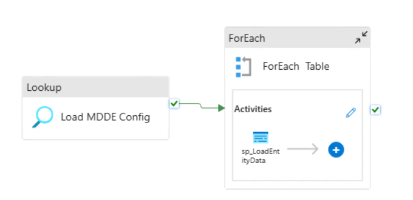

# ETL Azure Synapse Pipeline

{ align=right width="90" }

Deze documentatie beschrijft de ETL pipelines die gebruik maken van de standaard laadprocedures(zie [ETL Laad Procedures](MDDE_ETL_procs.md)). Het doel van deze pipelines is door middel van de standaard laadprocedures op een gestandaardiseerde manier data uit brontabellen te laden naar doeltabellen binnen dezelfde database en schema.

### Azure Synapse pipeline : MDDE/SQLPOOL2/PL_MDDE_Orchestration_Main

{ width="360" }

Dit is de hoofdpijpline die eerst de set config mappingen records insert in de configexecution tabel  vanuit de config tabel. Daarna worden de tabellen getruncate (die als full load (LoadType = 0) zijn configureerd). Volgende stap is  de combinatie  runlevel en runlevelstage uitlezen/sorteren uit de `Configexecution`-tabel.
Voor elke unieke runlevel/runlevelstage combinatie wordt de subpipeline `PL_MDDE_Orchestration_Loop` aangeroepen (For Each mechanisme). De runlevel,runlevelstage en Loadrunid (van de pipeline) wordt  meegegeven. 
Hierbij wordt wel gewacht totdat de subpipeline  voor een runlevel/runlevelstage combinatie afgerond is alvorens de volgende combinatie opgestart wordt.

### Azure Synapse pipeline : MDDE/SQLPOOL2/PL_MDDE_Orchestration_Loop

{ width="360" }

De configuratie wordt gelezen uit de `Configexecution`-tabel voor de meegegeven runlevel en runlevelstage en betreffende workkflowrunid.
Op basis van de configuratie wordt er parallel sessies opgestart (max 5) om  de  hoofd storeprocedure (`sp_LoadEntityData`) aan te roepen. Deze storeprocedure bepaalt of entity geladen mag worden(i.v.m. eventueel falen predecessors) en houdt  rekening met full load/incremental laden.

