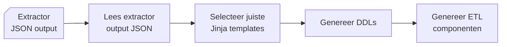
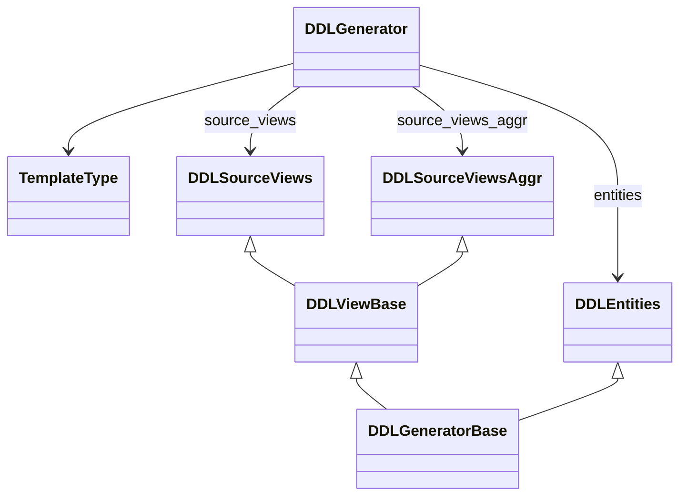

# Generator
{ align=right width="90" }

Deze documentatie beschrijft de structuur, werking en samenhang van componenten in de Generator package in Genesis. De Generator bevat de kernlogica voor het genereren van DDL- (Data Definition Language) en ETL-scripts (Extract, Transform, Load) op basis van een JSON-model, doorgaans gegenereerd door een tool genaamd RETW. De hoofdklasse, `DDLGenerator`, regelt het inlezen van configuratie- en modelfiles, laadt Jinja2-templates en delegeert het genereren van DDL/ETL-bestanden aan gespecialiseerde componenten. Het ontwerp is uitbreidbaar en platformbewust, met ondersteuning voor verschillende templatesets per doeldatabaseplatform.

## Belangrijke componenten

### `TemplateType` (Enum)

* Bevat de verschillende typen SQL-templates (zoals schema, tabel, entiteit, view, stored procedure, bronview, geaggregeerde bronview).
* Wordt gebruikt om het juiste Jinja2-template te selecteren voor elke DDL- of ETL-generatiestap.

### `DDLGenerator` (Klasse)

**Doel**: Centrale klasse die verantwoordelijk is voor het volledige proces van het genereren van DDL- en ETL-bestanden op basis van een JSON-model.

**Initialisatie**:

* Leest configuratieparameters.
* Zet de output- en templatemappen op.
* Initialiseert helperklassen voor het verwerken van entiteiten en views.

**Belangrijke methoden**:

* `generate_ddls`: Hoofdmethode die het proces aanstuurt. Leest het model, verzamelt identifiers en start de DDL/ETL-generatie voor entiteiten en views. Roept de onderstaande functies aan.
* `_read_model_file`: Leest en verwerkt het ingevoerde JSON-modelbestand.
* `_get_template`: Laadt een Jinja2-template op basis van het opgegeven `TemplateType`.
* `_collect_identifiers`: Extraheert identifier-informatie uit mappings in het model. Bereidt data voor die nodig is voor [businesssleutelgeneratie](#bepalen-van-business-keys) in tabel DDL’s.

---

## Integratie met andere componenten

* Maakt gebruik van helperklassen zoals `DDLEntities`, `DDLSourceViews` en `DDLSourceViewsAggr` voor het genereren van DDL-code voor entiteiten en views.
* Gebruikt een logging utility (`get_logger`) voor gestructureerde logging.
* Werkt met Jinja2 voor templategebaseerde codegeneratie, wat flexibele en platformgerichte output mogelijk maakt. Door gebruik te maken van Jinja2-templates wordt de SQL-/DDL-logica gescheiden van de Python-code, wat het eenvoudig maakt om scripts aan te passen aan verschillende databaseplatforms.

### Klassendiagram

## Bepalen van business-keys

In de generator wordt ook bepaald hoe Business keys worden opgebouwd, meer documentatie hierover is te vinden op de [Business Keys pagina](Business_Keys.md).

---

## API referentie

### ::: src.generator.generator.DDLGenerator

---

### ::: src.generator.ddl_entities.DDLEntities

---

### ::: src.generator.ddl_views_source.DDLSourceViews

---

### ::: src.generator.ddl_views_source_aggr.DDLSourceViewsAggr

---

### ::: src.generator.ddl_views_base.DDLViewBase

---

### ::: src.generator.ddl_base.DDLGeneratorBase

### ::: src.generator.ddl_base.DdlType
