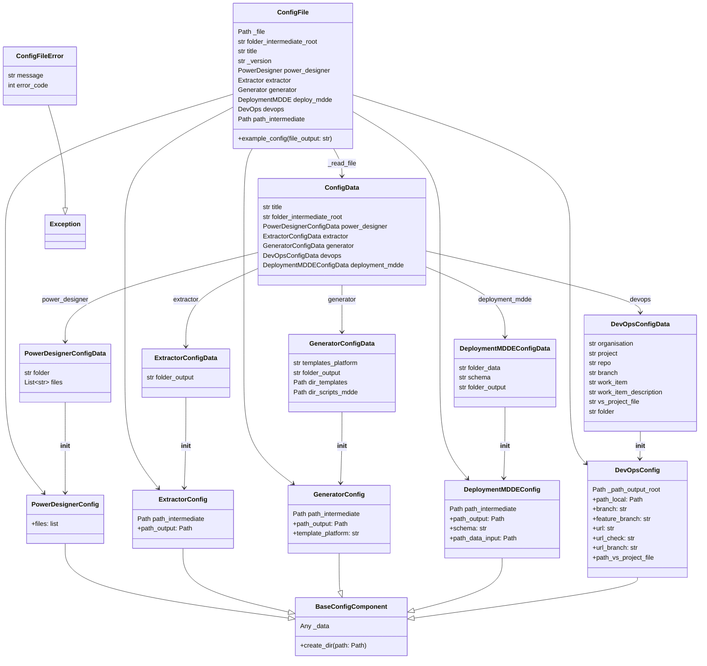

# Configuratie

{ align=right width="90" }

De Orkestrator gebruikt een [YAML](https://www.redhat.com/en/topics/automation/what-is-yaml){target="_blank"} configuratiebestand om de workflow aan te sturen, en bevat onder andere informatie over de Power Designer LDM bestanden, technische implementatie en DevOps configuratie.

De uitgelezen configuratie wordt opgeslagen in dataclasses die zijn afgeleid van de YAML-structuur om zeker te stellen dat alle verplichte configuratieopties zijn ingevuld en dat hiervoor de juiste datatypes zijn gebruikt.

## Voorbeeld configuratiebestand

Hieronder is een voorbeeld van een configuratiebestand weergegeven, voorzien van commentaar dat aangeeft wat de betekenis is van de betreffende onderdelen.

```yaml
# Titel van het project of run
title: "voorbeeld-run"

# Hoofdmap waarin alle tussen-bestanden en output worden opgeslagen
folder_intermediate_root: "/pad/naar/intermediate"

# Instellingen voor PowerDesigner-modellen
power-designer:
  # Submap waar PowerDesigner-bestanden zich bevinden
  folder: "PowerDesigner"
  # Lijst met LDM-bestanden die geanalyseerd moeten worden
  files:
    - "model1.ldm"
    - "model2.ldm"

# Extractor-instellingen
extractor:
  # Submap waar geëxtraheerde gegevens (RETW-bestanden) worden opgeslagen
  folder: "RETW"

# Generator-instellingen
generator:
  # Submap waar gegenereerde output wordt opgeslagen
  folder: "CentralLayer"
  # Platformconfiguratie voor templates (bijv. "dedicated-pool" of "shared")
  templates_platform: "dedicated-pool"

deployment-mdde:
  folder-output: "CentralLayer/DA_MDDE"
  schema: "MDDE"
  folder-data: "./etl_templates/input/codeList/"


## Publisher-instellingen - Out of date
#publisher:
#  # Pad naar de Visual Studio-projectmap
#  vs_project_folder: "VSProject"

# DevOps-integratie-instellingen
devops:
  # Lokale folder voor het repository
  folder: "GIT_repo"
  # Naam van de Azure DevOps organisatie
  organisation: "organisatie-naam"
  # Naam van het project in Azure DevOps
  project: "project-naam"
  # Repository waarin wijzigingen worden gepusht
  repo: "repository-naam"
  # Naam van de branch waarop gewerkt wordt
  branch: "collaboration"
  # Werkitem-ID dat gekoppeld wordt aan deze deployment
  work_item: "12345"
  # Omschrijving van het werkitem of de deployment
  work_item_description: "Beschrijving van deze automatische deployment"
  # Pad naar het .sqlproj-bestand binnen het project
  vs-project-file: "./CentralLayer/3. Central Layer.sqlproj"
```

### Belangrijke componenten

**`ConfigFile`**: Leest de configuratie uit een YAML-bestand en biedt toegang tot de verschillende configuratiecomponenten als properties. Valideert de configuratie en zorgt voor correcte paden en standaardwaarden.

**`PowerDesignerConfig`**: Bevat logica voor het ophalen en valideren van PowerDesigner-bestanden uit de configuratie.

**`ExtractorConfig`**: Bevat logica voor het bepalen van de outputfolder voor extractie en het aanmaken van de benodigde directories.

**`GeneratorConfig`**: Bevat logica voor het bepalen van de outputfolder voor gegenereerde code en het ophalen van het gebruikte template-platform.

**`DeploymentMDDEConfig`**: Bevat logica voor het bepalen van de outputfolder, het schema en de inputfolder voor MDDE deployment.

**`DevOpsConfig`**: Bevat logica voor het bepalen van lokale repository-paden, branch-namen, DevOps-URLs en het pad naar het Visual Studio projectbestand.

#### Configuratie validatie

**`ConfigFileError`** Exception die wordt opgegooid bij fouten in het configuratiebestand, zoals ontbrekende of foutieve waarden.

**`ConfigData`** Dataclass die de volledige configuratiestructuur bevat, bestaande uit alle componenten.

**`PowerDesignerConfigData`**, **`ExtractorConfigData`**, **`GeneratorConfigData`**, **`DeploymentMDDEConfigData`**, **`DevOpsConfigData`** Dataclasses die de configuratie voor de respectievelijke componenten bevatten.

#### Klasse diagram

Hieronder is de samenhang tussen de verschillende configuratiegerelateerde klassen weergegeven.



---

## API referentie

### Configuratie lezen

#### ::: src.orchestrator.config_file.ConfigFile

---

#### ::: src.orchestrator.config_file.PowerDesignerConfig

---

#### ::: src.orchestrator.config_file.ExtractorConfig

---

#### ::: src.orchestrator.config_file.GeneratorConfig

---

#### ::: src.orchestrator.config_file.DeploymentMDDEConfig

---

#### ::: src.orchestrator.config_file.DevOpsConfig

---

### Configuratie validatie API

#### ::: src.orchestrator.config_definition.ConfigFileError

---

#### ::: src.orchestrator.config_definition.ConfigData

---

#### ::: src.orchestrator.config_definition.DevOpsConfigData

---

#### ::: src.orchestrator.config_definition.ExtractorConfigData

---

#### ::: src.orchestrator.config_definition.GeneratorConfigData

---

#### ::: src.orchestrator.config_definition.PowerDesignerConfigData
