# Genesis Orkestratie

{ align=right width="90" }

Hoewel het Python-script, ```main.py``` in de directory ```src```, dient de Orkestrator als het punt waar alle functionaliteiten samenkomen en dient het als de "Genesis" workflow-orkestrator. Het leest een [configuratiebestand](Configuration.md) uit, waarvan de locatie wordt meegegeven als commando-argument, en start het workflowproces. De voornaamste functie is het beheren en uitvoeren van de stappen die in de configuratie zijn gedefinieerd, mogelijk inclusief uitrol-stappen.

De `Orchestrator` klasse coördineert het extraheren van datamodellen, integratie van de verschillende modellen en mappings tot één ETL DAG, codegeneratie, het aanmaken van deploy-scripts en het beheer van repositories. Het fungeert als het centrale startpunt voor het uitvoeren van het ETL-proces, waarbij wordt gewaarborgd dat elke stap in de juiste volgorde wordt uitgevoerd en eventuele problemen tijdens de verwerking worden afgehandeld.

## 🚀 Gebruik

* Zorg dat alle PowerDesigner-bestanden op de juiste locatie staan.
* Vul een YAML-configuratiebestand in op basis van het sjabloon ([zie voorbeeld](Configuration.md#voorbeeld-configuratiebestand)).
* Start het script met het pad naar het configuratiebestand: ```python main.py path/to/config.yaml```

Wanneer het main script wordt gestart worden de volgende stappen ondernomen:

```mermaid
sequenceDiagram
  participant O as Orchestrator
  participant CF as Configuratie-<br>bestand
  participant PD as Power Designer<br>-bestand
  participant E as Extractor
  participant I as Integrator
  participant DG as Code<br>generator
  participant MDDE as Deployment<br>generator
  participant DevOps as Repository-<br>beheer

  O->>CF: Leest configuratie
  loop Voor elk Power Designer-bestand
    O->>E: Extractie Power Designer
    E->>E: Transformeer data
    E-->>O: Weggeschreven naar JSON
  end
  O->>I: Integreer JSONs tot één ETL DAG
  I->>I: Controleert afhankelijkheden
  O->>DG: Integreer ETL DAG(geëxtraheerde data)
  O->>MDDE: Genereert MDDE uitrolcode
  O->>DevOps: DevOps repository uitrol
  O-->>O: Schrijft problemen weg naar bestand
  O->>O: Stopt uitvoering
```



## Belangrijkste onderdelen

### `Orchestrator` klasse

* De kernklasse die verantwoordelijk is voor het beheren van de ETL-workflow.
* Behandelt het laden van configuraties, extractie, afhankelijkheidsanalyse, codegeneratie, genereren van deploy-scripts en repositorybeheer.
* Biedt de methode `start_processing` als entrypoint voor de workflow, met een optie om DevOps-gerelateerde stappen over te slaan.

### [Extractieproces](../Extractor.md)

* Extraheert logical data models en mappings uit PowerDesigner LDM-bestanden met behulp van de klasse `PDDocument`.
* Slaat de geëxtraheerde data op als JSON-bestanden voor verdere verwerking.

### [Integreren Power Designer documenten](../Integrator/Integrator.md)

* Integreert de extracten van de Power Designer modellen tot één ETL flow.
* Voegt technische keuzes toe aan de ETL flow.
* Gebruikt de klasse DagReporting om ETL-afhankelijkheden tussen de geëxtraheerde bestanden te analyseren.
* Genereert een volgorde van mappings en visualiseert de ETL-flow in een HTML-rapport.

### [Codegeneratie](../Generator.md)

* Maakt gebruik van de klasse `DDLGenerator` om deploy-code (zoals DDL-scripts) te genereren op basis van de geëxtraheerde data en afhankelijkheden.
* Behandelt en logt eventuele fouten die tijdens de codegeneratie optreden.

### [Genereren van deployment-scripts](../Deploy_MDDE/Deploy_MDDE.md)

* Roept de klasse DeploymentMDDE aan om post-deployment scripts te genereren volgens de vastgestelde mappingvolgorde.

### [Repositorybeheer](../Repository_Manager.md)

* Integreert met de klasse [`RepositoryManager`](../Repository_Manager.md) om DevOps repositories te klonen, bij te werken en te beheren.
* Behandelt het toevoegen van gegenereerde code en deployment scripts aan de repository, met ruimte voor toekomstige uitbreidingen (zoals het pushen van wijzigingen).

### [Probleemafhandeling](../Logtools.md)

* Controleert op problemen die tijdens de verwerking zijn opgetreden via de issue_tracker.
*

### [Logging](../Logtools.md)

* Maakt gebruik van een gecentraliseerde logger om informatieve berichten te tonen gedurende de hele workflow, wat helpt bij monitoring en debugging.
* Een aangepaste logging handler die waarschuwingen en fouten bijhoudt, `issue_tracker`, en schrijft een rapport met gevonden issues weg naar een CSV-bestand waarmee een modelleur op de hoogte kan worden gesteld van issues die in het model zijn aangetroffen.

## Klassendiagram

In de klassendiagram worden de details weergegeven van de Orchestrator klasse, meer details over de configuratieklassen zijn [hier](Configuration.md) te vinden.


## API referentie

### ::: src.orchestrator.orchestrator.Orchestrator

### ::: src.orchestrator.orchestrator.ExtractionIssuesFound
