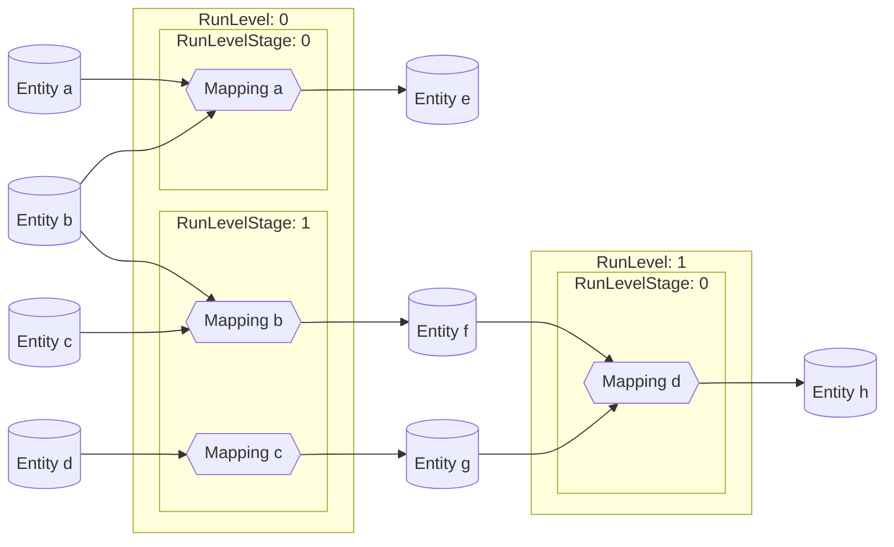
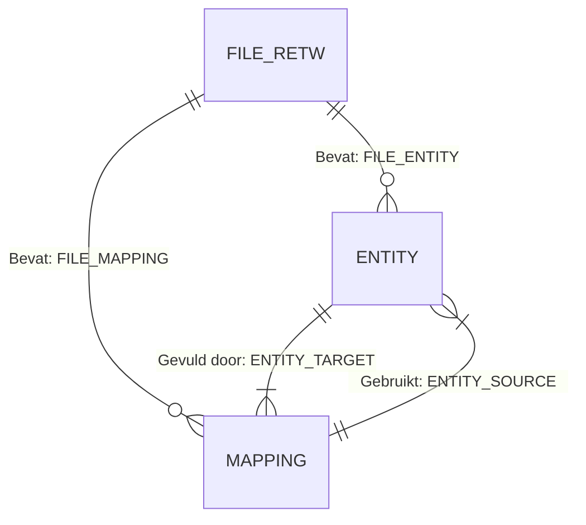
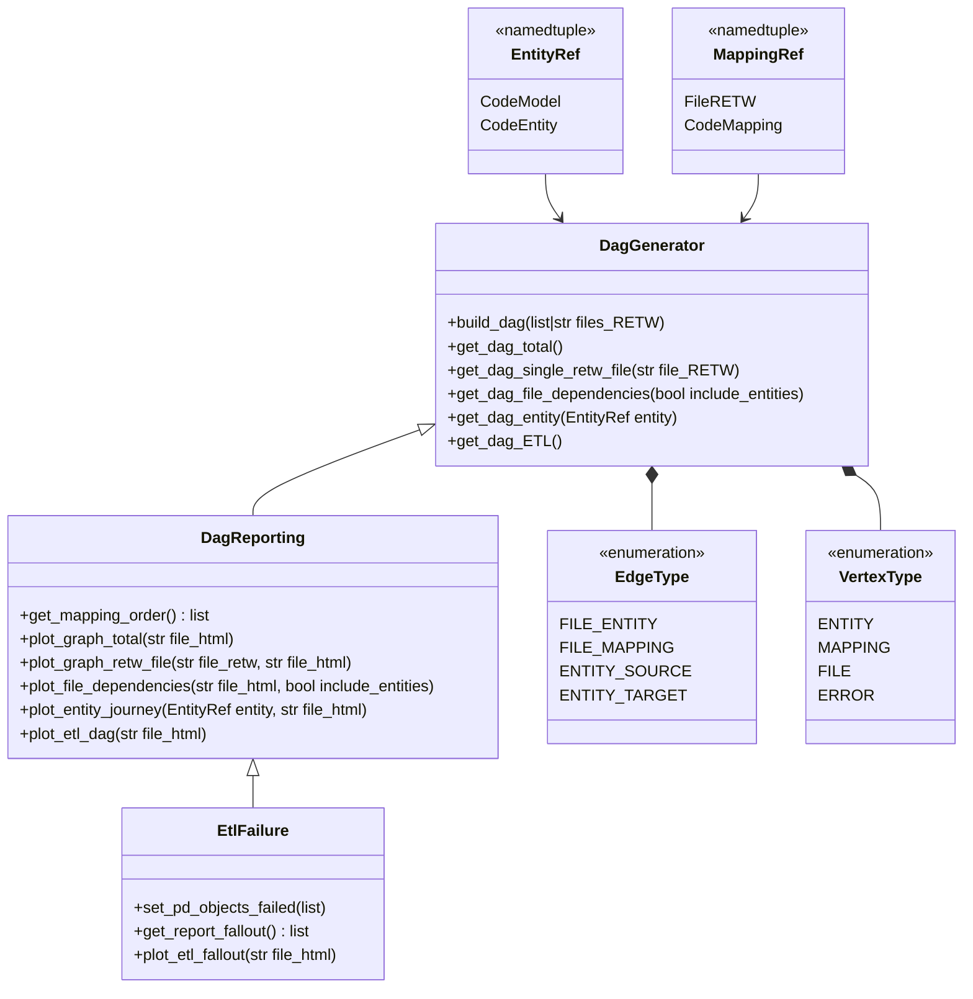

# Integreren extracten

{ align=right width="90" }

De **`integrator`**-package biedt een modulaire en uitbreidbare set Python-componenten voor het modelleren, analyseren, implementeren en visualiseren van **ETL-workflows** op basis van **Directed Acyclic Graphs (DAG’s)**. Deze workflows worden gedefinieerd aan de hand van RETW JSON-bestanden, waarin de afhankelijkheden tussen databronnen, mappings en modellen beschreven zijn.

De kernfunctionaliteit van de package is verdeeld over drie klassen:

- **`DagBuilder`**: Verantwoordelijk voor het bouwen van de structuur van de ETL-DAG.
- **`DagImplementation`**: Breidt deze structuur uit met uitvoeringslogica, zoals run-levels en deadlock-preventie.
- **`DagReporting`**: Voegt visualisatie- en rapportagemogelijkheden toe.

Deze modulaire opbouw maakt het mogelijk om de componenten afzonderlijk of in combinatie te gebruiken binnen grotere data-integratiesystemen of CI/CD pipelines.

---

## Belangrijkste Klassen en Functionaliteiten

### `DagBuilder`

- **Doel**: Opbouwen en beheren van de ruwe DAG op basis van inputbestanden.
- **Functionaliteiten**:
  - Inlezen van één of meerdere RETW-bestanden.
  - Parseren van modellen, mappings en entiteiten.
  - Genereren van een `igraph.Graph` met knopen en randen die respectievelijk objecten en afhankelijkheden representeren.
  - Genereert unieke en stabiele knoop-ID’s op basis van MD5-hashing.
  - Ondersteuning voor subgraaf-extractie:
    - Per bestand
    - Per entiteit
    - Op basis van mappings
  - Annotatie van knopen met statistieken zoals ETL-levels en run-levels.
  - Detectie van inconsistente of onvolledige flows via foutmeldingen en logging.

### `DagImplementation`

- **Doel**: Toevoegen van uitvoeringslogica aan de basis-DAG.
- **Functionaliteiten**:
  - Bepalen van de juiste uitvoeringsvolgorde van mappings, afhankelijk van gekozen deadlock-preventiestrategie (`SOURCE` of `TARGET`).
      * Run level: waar in de Directed Acyclic Graph ([DAG](https://nl.wikipedia.org/wiki/Gerichte_acyclische_graaf){target="_blank"}) hiërarchie, gaande van bron-entiteiten naar eind-entiteiten, de mapping zich bevindt. Mappings die enkel bron-entiteiten gebruiken krijgen run level 0, de volgende run levels worden bepaald door het aantal mappings dat in de hiërarchie vóór de huidige mapping komt.
      * Run level stage: Als mappings op hetzelfde run level dezelfde entiteiten gebruiken, moeten ze een verschillende uitvoeringsvolgorde krijgen om deadlocks te voorkomen. Een [greedy coloring algoritme](https://www.youtube.com/watch?v=vGjsi8NIpSE){target="_blank"} wordt gebruikt om de uitvoeringsvolgorde binnen een run level te bepalen. Er kunnen nu twee typen dead-locks voorkomen worden met een `DeadlockPrevention` type.
    * `SOURCE`: een brontabel kan niet door meerdere mappings tegelijkertijd worden gebruikt
    * `TARGET`: en doeltabel kan niet door meerdere mappings tegelijkertijd worden gebruikt

  - Groeperen van mappings in stages voor veilige en efficiënte parallelle uitvoering.
  - Detecteren van conflicten tussen mappings op basis van gedeelde entiteiten.
  - Bieden van een gesorteerde `run config` die klaar is voor deployment of schedulers.
  - Mogelijkheid tot uitbreiden met aangepaste strategieën voor conflictoplossing.

### `DagReporting`

- **Doel**: Verhogen van inzicht en traceerbaarheid door middel van visualisatie.
- **Functionaliteiten**:
  - Instellen van visuele attributen per knoop: kleur, vorm, hiërarchie, tooltip.
  - Classificatie van knopen op basis van positie in de flow (`START`, `INTERMEDIATE`, `END`).
  - Conversie van `igraph.Graph` naar `networkx.DiGraph` en export naar HTML via `pyvis`.
  - Vooraf gedefinieerde visualisaties:
    - Volledige DAG (alle objecten)
    - Per bestand
    - Afhankelijkheden tussen bestanden
    - Entiteitstrajecten (de volledige stroom voor een bepaalde entiteit)
    - De pure ETL-flow (entiteiten en mappings zonder bestandseenheden)
  - Detectie van ontbrekende entiteitsdefinities in bestanden.

---

## Visualisatie

De visualisatiecomponent maakt gebruik van `pyvis` in combinatie met `networkx` om interactieve HTML-bestanden te genereren. Visualisaties bieden:
- **Zoom & pan-functionaliteit**
- **Klikbare knopen met tooltips**
- **Hiërarchische lay-out op basis van uitvoeringsvolgorde**
- **Visuele onderscheidingen tussen types (bestand, entiteit, mapping)**

Deze bestanden kunnen lokaal of via een webserver geopend worden en zijn geschikt voor analyses, presentaties of documentatie.

---

## 🚀 Gebruik

De map ```dependency_checker``` bevat een bestand ```example.py``` dat laat zien hoe alle klassen gebruikt kunnen worden voor bovenstaande doeleinden.

Het voorbeeld verwijst naar een lijst van voorbeeld-RETW-bestanden die geplaatst zijn in de submap ```retw_examples```. De volgorde van de bestanden in de lijst is niet relevant voor de functionaliteit, dus je kunt eigen bestanden in willekeurige volgorde aan de lijst toevoegen.

<details><summary>Voorbeeld code</summary>

```python title="etl_templates\src\dependencies_checker\example.py"
import json

from dependencies_checker import DagReporting, EntityRef, EtlFailure

if __name__ == "__main__":
    """Examples of the class use-cases
    """
    dir_output = "etl_templates/output/etl_report/"
    dir_RETW = "etl_templates/src/dependencies_checker/retw_examples/"
    # List of RETW files to process, order of the list items is irrelevant
    lst_files_RETW = [
        "Usecase_Aangifte_Behandeling.json",
        "Usecase_Test_BOK.json",
        "DMS_LDM_AZURE_SL.json",
    ]
    lst_files_RETW = [dir_RETW + file for file in lst_files_RETW]
    dag = DagReporting()
    dag.add_RETW_files(files_RETW=lst_files_RETW)

    """File dependencies
    * Visualizes of the total network of files, entities and mappings
    * Visualizes of a given entity's network of connected files, entities and mappings
    * Visualizes dependencies between files, based on entities they have in common
    * Lists entities which are used in mappings, but are not defined in a Power Designer document
    """
    # Visualization of the total network of files, entities and mappings
    dag.plot_graph_total(file_html=f"{dir_output}all.html")
    # Visualization of a given entity's network of connected files, entities and mappings
    entity = EntityRef("Da_Central_CL", "AggrProcedureCategory")
    dag.plot_entity_journey(
        entity=entity,
        file_html=f"{dir_output}entity_journey.html",
    )
    # Visualization of dependencies between files, based on entities they have in common
    dag.plot_file_dependencies(
        file_html=f"{dir_output}file_dependencies.html", include_entities=True
    )
    # Entities which are used in mappings, but are not defined in a Power Designer document
    lst_entities = dag.get_entities_without_definition()
    with open(f"{dir_output}entities_not_defined.jsonl", "w", encoding="utf-8") as file:
        for item in lst_entities:
            file.write(json.dumps(item) + "\n")

    """ETL Flow (DAG)
    * Determine the ordering of the mappings in an ETL flow
    * Visualizes the ETL flow for all RETW files combined
    """
    # Determine the ordering of the mappings in an ETL flow: a list of mapping dictionaries with their RunLevel and RunLevelStage
    lst_mapping_order = dag.get_mapping_order()
    with open(f"{dir_output}mapping_order.jsonl", "w", encoding="utf-8") as file:
        for item in lst_mapping_order:
            file.write(json.dumps(item) + "\n")
    # Visualization of the ETL flow for all RETW files combined
    dag.plot_etl_dag(file_html=f"{dir_output}ETL_flow.html")

    """Failure simulation
    * Set a failed object status
    * Visualization of the total network of files, entities and mappings
    """
    lst_entities_failed = [
        EntityRef("Da_Central_CL", "AggrLastStatus"),
        EntityRef("Da_Central_BOK", "AggrLastStatus"),
    ]  # Set for other examples
    etl_simulator = EtlFailure()
    # Adding RETW files to generate complete ETL DAG
    etl_simulator.add_RETW_files(files_RETW=lst_files_RETW)
    # Set failed node
    etl_simulator.set_entities_failed(lst_entities_failed)
    # Create fallout report file
    lst_mapping_order = etl_simulator.get_report_fallout()
    with open(f"{dir_output}dag_run_fallout.json", "w", encoding="utf-8") as file:
        json.dump(lst_mapping_order, file, indent=4)
    # Create fallout visualization
    etl_simulator.plot_etl_fallout(file_html=f"{dir_output}dag_run_report.html")
```
</details>

## Klassenstructuur



### Bouwen van de ETL DAG

De mapping dependency parser gebruikt [grafen](https://nl.wikipedia.org/wiki/Graaf_(wiskunde)){target="_blank"}, meer specifiek een [DAG](https://nl.wikipedia.org/wiki/Gerichte_acyclische_graaf){target="_blank"}, wat een netwerkvoorstelling is van de bestanden, entiteiten (bijv. tabellen) en mappings. Deze sectie legt uit hoe de DAG gecreëerd wordt.

Voor elk RETW-bestand worden de mappings geëxtraheerd, en de mappings, bron- en doel-entiteiten worden omgezet naar knopen (ook wel vertices genoemd). Vervolgens worden er verbindingen (ook wel edges genoemd) gelegd tussen de bron-entiteiten en de mappings en tussen de mappings en de doel-entiteiten. Als alle mappings zijn omgezet in knopen en verbindingen, kunnen deze gecombineerd worden tot een netwerk. Deze netwerkvoorstelling maakt de berekeningen mogelijk die in de introductie zijn beschreven.



In een Power Designer-document (en het corresponderende RETW-bestand) worden alle objecten geïdentificeerd door hun 'Id'-attribuut, dat er bijvoorbeeld uitziet als 'o123'. Deze Id is intern geldig binnen een document, maar niet geschikt om objecten te identificeren wanneer we de resultaten van meerdere Power Designer-documenten combineren. Daarom moeten er nieuwe identifiers aangemaakt worden zodat er geen conflicten ontstaan tussen documenten, en tegelijkertijd de integriteit behouden blijft (bijvoorbeeld als een doel-entiteit van het ene document een bron is in een mapping van een ander document). Hoe wordt dit bereikt?

* We gaan ervan uit dat mappings uniek zijn tussen Power Designer-documenten. Om een unieke mapping-ID te maken, wordt een hash toegepast op de combinatie van de RETW-bestandsnaam en de mapping-code.

* Voor consistente identificatie van entiteiten over documenten heen, wordt een hash toegepast op de combinatie van de Code- en CodeModel-eigenschappen van een entiteit.

### Belangrijke componenten

* **```DagGenerator```**: Deze klasse vormt de basis van het project. Het ontleedt RETW-bestanden, extraheert entiteiten en mappings, en bouwt de DAG. Belangrijke methoden zijn ```add_RETW_file``` (voegt een RETW-bestand toe), ```get_dag_total``` (geeft de totale DAG terug), ```get_dag_ETL``` (geeft de ETL-flow DAG terug), en andere methoden om specifieke sub-grafen op te halen.

* **```DagReporting```**: Deze klasse gebruikt de DAG van ```DagGenerator``` om inzichten en visualisaties te leveren. Methoden zijn onder andere ```get_mapping_order``` (bepaalt de uitvoeringsvolgorde), ```plot_graph_total``` (visualiseert de totale DAG), ```plot_etl_dag``` (visualiseert de ETL-flow), en andere methoden om afhankelijkheden en relaties weer te geven.

* **```EtlFailure```**: Deze klasse simuleert en analyseert de impact van falende ETL-jobs. De methode ```set_entities_failed``` specificeert de falende componenten, en ```get_report_fallout``` en ```plot_etl_fallout``` leveren rapportages en visualisaties van de gevolgen.

* **```EntityRef```** en **```MappingRef```**: Deze namedtuples representeren respectievelijk entiteiten en mappings, en geven een gestructureerde manier om ze in de DAG te refereren.

* **```VertexType```** en **```EdgeType```**: Deze enums definiëren de typen knopen en verbindingen in de DAG, wat bijdraagt aan duidelijkheid en onderhoudbaarheid van de code.

Het project gebruikt een graaf-gebaseerde aanpak om ETL-afhankelijkheden te representeren en analyseren, en biedt waardevolle inzichten voor het begrijpen en optimaliseren van het ETL-proces. ```DagGenerator``` bouwt de DAG, ```DagReporting``` verzorgt analyse en visualisatie, en ```EtlFailure``` simuleert foutscenario's.

### Klassendiagram

In deze sectie worden de klassen beschreven, waarvoor ze gebruikt worden en hoe ze samenhangen.



## Mogelijke uitbreidingen

**CLI-interface**
Een eenvoudige command line interface voor het aanroepen van de dependency checker zonder Python-code.

**Live monitoring integratie**
Koppeling met live logging om visuele representatie te koppelen aan een echte ETL-run.

**Modelvergelijking**
Functionaliteit om afhankelijkheden of de DAG te vergelijken tussen twee versies van een model (bijv. veranderingen doorvoeren detecteren).

## API referentie

### ::: src.integrator.dag_builder.DagBuilder

---

### ::: src.integrator.dag_builder.EdgeType

### ::: src.integrator.dag_builder.VertexType

---

### ::: src.integrator.dag_implementation.DagImplementation

---

### ::: src.integrator.dag_implementation.DeadlockPrevention

---

### ::: src.integrator.dag_reporting.DagReporting

---

### ::: src.integrator.dag_etl_failure.EtlFailure
