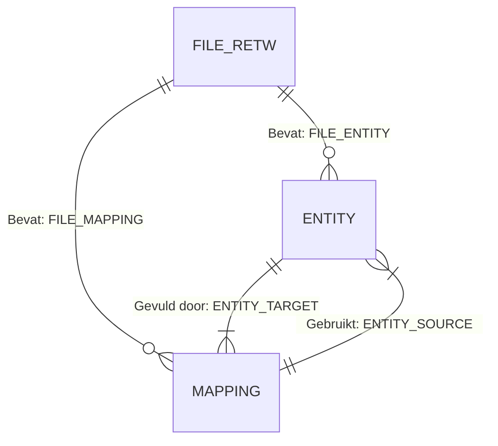
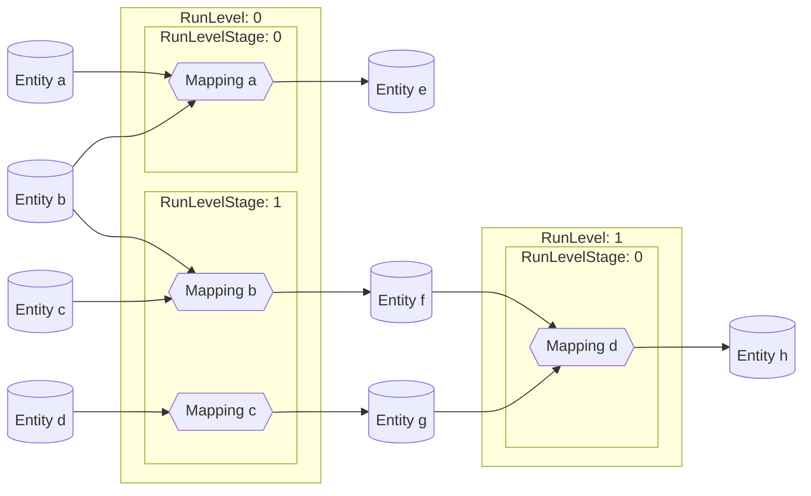
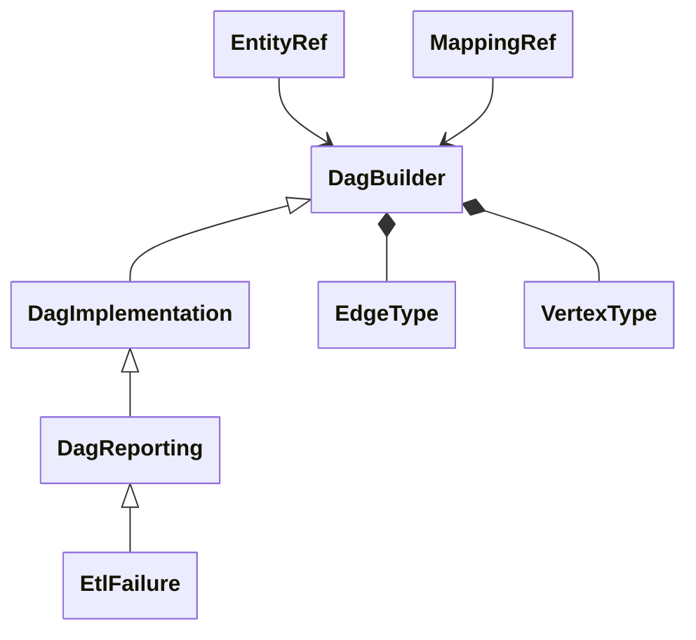

# Integreren ETL DAG

{ align=right width="90" }

De **`integrator`**-package biedt een modulaire en uitbreidbare set Python-componenten voor het modelleren, analyseren, implementeren en visualiseren van **ETL-workflows** op basis van **Directed Acyclic Graphs (DAG’s)**. Deze workflows worden gedefinieerd aan de hand van RETW JSON-bestanden, waarin de afhankelijkheden tussen databronnen, mappings en modellen beschreven zijn.

De kernfunctionaliteit van de package is verdeeld over drie klassen:

- **`DagBuilder`**: Verantwoordelijk voor het bouwen van de structuur van de ETL-DAG.
- **`DagImplementation`**: Breidt deze structuur uit met uitvoeringslogica, zoals run-levels en deadlock-preventie.
- **`DagReporting`**: Voegt visualisatie- en rapportagemogelijkheden toe.

Deze modulaire opbouw maakt het mogelijk om de componenten afzonderlijk of in combinatie te gebruiken binnen grotere data-integratiesystemen of CI/CD pipelines.

---

## Belangrijkste Klassen en Functionaliteiten

### `DagBuilder`

- **Doel**: Opbouwen en beheren van de ruwe DAG op basis van inputbestanden.
- **Functionaliteiten**:
  - Inlezen van één of meerdere RETW-bestanden.
  - Parseren van modellen, mappings en entiteiten.
  - Genereren van een `igraph.Graph` met knopen en randen die respectievelijk objecten en afhankelijkheden representeren.
  - Genereert unieke en stabiele knoop-ID’s op basis van MD5-hashing.
  - Ondersteuning voor subgraaf-extractie:
    - Per bestand
    - Per entiteit
    - Op basis van mappings
  - Annotatie van knopen met statistieken zoals ETL-levels en run-levels.
  - Detectie van inconsistente of onvolledige flows via foutmeldingen en logging.

#### Bouwen van de ETL DAG

De `DagBuilder` gebruikt [grafen](https://nl.wikipedia.org/wiki/Graaf_(wiskunde)){target="_blank"}, meer specifiek een [DAG](https://nl.wikipedia.org/wiki/Gerichte_acyclische_graaf){target="_blank"}, wat een netwerkvoorstelling is van de bestanden, entiteiten (bijv. tabellen) en mappings. Deze sectie legt uit hoe de DAG gecreëerd wordt.

Voor elk RETW-bestand worden de mappings geëxtraheerd, en de mappings, bron- en doel-entiteiten worden omgezet naar knopen (ook wel vertices genoemd). Vervolgens worden er verbindingen (ook wel edges genoemd) gelegd tussen de bron-entiteiten en de mappings en tussen de mappings en de doel-entiteiten. Als alle mappings zijn omgezet in knopen en verbindingen, kunnen deze gecombineerd worden tot een netwerk. Deze netwerkvoorstelling maakt de berekeningen mogelijk die in de introductie zijn beschreven.

In een Power Designer-document (en het corresponderende RETW-bestand) worden alle objecten geïdentificeerd door hun 'Id'-attribuut, dat er bijvoorbeeld uitziet als 'o123'. Deze Id is intern geldig binnen een document, maar niet geschikt om objecten te identificeren wanneer we de resultaten van meerdere Power Designer-documenten combineren. Daarom moeten er nieuwe identifiers aangemaakt worden zodat er geen conflicten ontstaan tussen documenten, en tegelijkertijd de integriteit behouden blijft (bijvoorbeeld als een doel-entiteit van het ene document een bron is in een mapping van een ander document). Hoe wordt dit bereikt?

* We gaan ervan uit dat mappings uniek zijn tussen Power Designer-documenten. Om een unieke mapping-ID te maken, wordt een hash toegepast op de combinatie van de RETW-bestandsnaam en de mapping-code.

* Voor consistente identificatie van entiteiten over documenten heen, wordt een hash toegepast op de combinatie van de Code- en CodeModel-eigenschappen van een entiteit.

---

### `DagImplementation`

- **Doel**: Toevoegen van uitvoeringslogica aan de basis-DAG.
- **Functionaliteiten**:
    - Bepalen van de juiste uitvoeringsvolgorde van mappings, afhankelijk van gekozen deadlock-preventiestrategie (`SOURCE` of `TARGET`).
        * Run level: waar in de Directed Acyclic Graph ([DAG](https://nl.wikipedia.org/wiki/Gerichte_acyclische_graaf){target="_blank"}) hiërarchie, gaande van bron-entiteiten naar eind-entiteiten, de mapping zich bevindt. Mappings die enkel bron-entiteiten gebruiken krijgen run level 0, de volgende run levels worden bepaald door het aantal mappings dat in de hiërarchie vóór de huidige mapping komt.
        * Run level stage: Als mappings op hetzelfde run level dezelfde entiteiten gebruiken, moeten ze een verschillende uitvoeringsvolgorde krijgen om deadlocks te voorkomen. Een [greedy coloring algoritme](https://www.youtube.com/watch?v=vGjsi8NIpSE){target="_blank"} wordt gebruikt om de uitvoeringsvolgorde binnen een run level te bepalen. Er kunnen nu twee typen dead-locks voorkomen worden met een `DeadlockPrevention` type.
            * `SOURCE`: een brontabel kan niet door meerdere mappings tegelijkertijd worden gebruikt
            * `TARGET`: en doeltabel kan niet door meerdere mappings tegelijkertijd worden gebruikt
    - Change detection om wijzigingen in de tabellen tijdens het incrementeel laadproces te ondersteunen worden Hashkeys gebruikt. Hierover is meer documentatie te vinden op de [Change Detection pagina](X_HashKey.md)
    - Groeperen van mappings in stages voor veilige en efficiënte parallelle uitvoering.
    - Detecteren van conflicten tussen mappings op basis van gedeelde entiteiten.
    - Bieden van een gesorteerde `run config` die klaar is voor deployment of schedulers.
    - Mogelijkheid tot uitbreiden met aangepaste strategieën voor conflictoplossing.

#### Bepaling van uitvoeringsvolgorde mappings

Hieronder is een schematische weergave te zien van hoe de run-levels en run-level-stages samenhangen. Het onderstaande voorbeeld is gebaseed op een `DeadlockPrevention` om dead-locks te voorkomen op bron entiteiten.

---

### `DagReporting`

- **Doel**: Verhogen van inzicht en traceerbaarheid door middel van visualisatie.
- **Functionaliteiten**:
    - Instellen van visuele attributen per knoop: kleur, vorm, hiërarchie, tooltip.
    - Classificatie van knopen op basis van positie in de flow (`START`, `INTERMEDIATE`, `END`).
    - Conversie van `igraph.Graph` naar `networkx.DiGraph` en export naar HTML via `pyvis`.
    - Vooraf gedefinieerde visualisaties:
        - Volledige DAG (alle objecten)
        - Per bestand
        - Afhankelijkheden tussen bestanden
        - Entiteitstrajecten (de volledige stroom voor een bepaalde entiteit)
        - De pure ETL-flow (entiteiten en mappings zonder bestandseenheden)
    - Detectie van ontbrekende entiteitsdefinities in bestanden.

#### Visualisatie

De visualisatiecomponent maakt gebruik van `pyvis` in combinatie met `networkx` om interactieve HTML-bestanden te genereren. Visualisaties bieden:
- **Zoom & pan-functionaliteit**
- **Klikbare knopen met tooltips**
- **Hiërarchische lay-out op basis van uitvoeringsvolgorde**
- **Visuele onderscheidingen tussen types (bestand, entiteit, mapping)**

Deze bestanden kunnen lokaal of via een webserver geopend worden en zijn geschikt voor analyses, presentaties of documentatie.

---

### `EtlSimulator`

- **Doel**: Rapportage- en grafiekhulpmiddelen bieden om gebruikers in staat te stellen verschillende faalstrategieën te simuleren en hun verspreiding door de DAG te analyseren. Dit is geen standaard onderdeel van de Genesis Orkestratie.
- **Functionaliteiten**:
    - Een ETL-DAG op te bouwen vanuit configuratiebestanden.
    - Verschillende faalstrategieën te simuleren en hun verspreiding door de DAG te analyseren.
    - De status van elke mapping (ETL-stap) te volgen en te visualiseren in het geval van fouten.
    - Rapporten en visualisaties te genereren waarin wordt weergegeven welke componenten door fouten worden beïnvloed.
- **Gebruik**: Omdat de `EtlSimulator` geen standaard onderdeel is van de Orchestrator, wordt deze apart gebruikt in het script `etl_templates/src/failure_reporting.py`

---

## Klassendiagram

In deze sectie worden de klassen beschreven, waarvoor ze gebruikt worden en hoe ze samenhangen.

## Mogelijke uitbreidingen

**CLI-interface**
Een eenvoudige command line interface voor het aanroepen van de dependency checker zonder Python-code.

**Live monitoring integratie**
Koppeling met live logging om visuele representatie te koppelen aan een echte ETL-run.

**Modelvergelijking**
Functionaliteit om afhankelijkheden of de DAG te vergelijken tussen twee versies van een model (bijv. veranderingen doorvoeren detecteren).

## API referentie

---

### DAG Builder

`DagBuilder`: Deze klasse vormt de basis van het package. Het ontleedt RETW-bestanden, extraheert modelinformatie, entiteiten en mappings, en bouwt de DAG. Belangrijke methoden zijn `add_RETW_file` (voegt een RETW-bestand toe), `get_dag_total` (geeft de totale DAG terug), `get_dag_ETL` (geeft de ETL-flow DAG terug), en andere methoden om specifieke sub-grafen op te halen.

#### ::: src.integrator.dag_builder.DagBuilder

---

`VertexType` en `EdgeType`: Deze enums definiëren de typen knopen en verbindingen in de DAG, wat bijdraagt aan duidelijkheid en onderhoudbaarheid van de code.

#### ::: src.integrator.dag_builder.EdgeType

#### ::: src.integrator.dag_builder.VertexType

---

`EntityRef` en `MappingRef`: Deze namedtuples representeren respectievelijk entiteiten en mappings, en geven een gestructureerde manier om aan ze in de DAG te refereren.

#### ::: src.integrator.dag_builder.EntityRef

#### ::: src.integrator.dag_builder.MappingRef

---

### DAG implementation functionaliteiten

`DagImplementation`: Deze klasse voegt technische implementatie keuzes toe aan de DAG.

#### ::: src.integrator.dag_implementation.DagImplementation

---

Er kunnen nu twee typen dead-locks voorkomen worden met een `DeadlockPrevention` type: deadlocks op brontabellen en dead-locks op doeltabellen.

#### ::: src.integrator.dag_implementation.DeadlockPrevention

---

### Rapporteren over de DAG

`DagReporting`: Deze klasse gebruikt de DAG van `DagImplementation` om inzichten en visualisaties te leveren. Methoden zijn onder andere  `plot_graph_total` (visualiseert de totale DAG met de PD files die gebruikt zijn), `plot_etl_dag` (visualiseert de ETL-flow), en andere methoden om afhankelijkheden en relaties weer te geven.

#### ::: src.integrator.dag_reporting.DagReporting

---

### ETL Simulatie

`etl_templates/src/failure_reporting.py` biedt een opdrachtregeltool voor het simuleren en rapporteren van fouten in ETL-processen (Extract, Transform, Load), specifiek binnen de context van het "Genesis" ETL-systeem. Het orkestreert de extractie van datamodellen uit Power Designer-bestanden, bouwt een ETL-simulatie-DAG (Directed Acyclic Graph), en genereert visuele rapporten van faalscenario’s. De tool is bedoeld voor gebruik door data engineers of ontwikkelaars om de impact van specifieke mapping-fouten in ETL-pijplijnen te analyseren.

#### ::: src.failure_reporting.main

#### ::: src.failure_reporting.build_dag

---

`EtlSimulator` definieert een ETL (Extract, Transform, Load) DAG (Directed Acyclic Graph) simulatieframework, gericht op het modelleren, simuleren en visualiseren van de impact van fouten binnen ETL-pijplijnen.

#### ::: src.integrator.dag_etl_simulator.EtlSimulator

---

`MappingStatus`: Een opsomming van mogelijke statussen van ETL-mappings (bijv. Success, Failed, Did Not Run, Success but needs restoring).

#### ::: src.integrator.dag_etl_simulator.MappingStatus

---

`FailureStrategy`: Een opsomming van verschillende strategieën voor het simuleren van ETL-fouten (bijv. alleen opvolgers, alle gedeelde doelwitten, siblings, hele subcomponent, run-level).

#### ::: src.integrator.dag_etl_simulator.FailureStrategy

