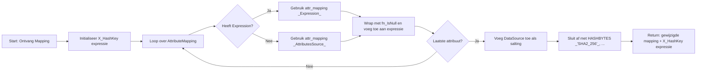

# Change Detection
{ align=right width="90" }

Bij het laden van entiteiten in het datawarehouse wordt gebruik gemaakt van source views die een `X_HashKey` bevatten om te bepalen of een record is gewijzigd sinds de vorige laadronde. Deze sleutel wordt opgebouwd op basis van alle attributen van de bronentiteit en wordt toegevoegd aan de views die door het ETL-proces worden gebruikt.

## Functieomschrijving

De Python-functie [`_mappings_add_hashkey(vs_mapping)`](#src.generator.ddl_views_source.DDLSourceViews.__build_x_hashkey) van de klasse `DagImplementation` genereert een SQL-expressie voor de `X_HashKey` door:

1. Alle attributen in de mapping te verwerken.
2. Voor elk attribuut een `fn_IsNull(...)`-expressie te maken om `NULL`-waarden te voorkomen.
3. De waarden samen te voegen met `CONCAT(...)`.
4. De gegenereerde string te hashen met `HASHBYTES('SHA2_256', ...)`.

Deze hash wordt vervolgens gebruikt om vast te stellen of een rij in de bron is veranderd ten opzichte van de eerder geladen versie.

## Voorbeeld SQL-uitdrukking

Een gegenereerde expressie zou eruit kunnen zien als:

```sql
[X_HashKey] = HASHBYTES('SHA2_256', CONCAT(
    DA_MDDE.fn_IsNull(CustomerID),
    DA_MDDE.fn_IsNull(Name),
    DA_MDDE.fn_IsNull(Address),
    'CRM')) -- DataSource als salting factor
```

## Doel `X_Hashkeys`

🕒 **Change Detection**: Door de hashwaarde te vergelijken met die van een eerder geladen versie, kan het systeem bepalen of een rij moet worden geüpdatet.

⚡ **Efficiëntie**: Vergelijken op een enkele kolom (`X_HashKey`) is veel efficiënter dan veld-voor-veld vergelijking.

🧩 **Consistency**: Gebruik van `fn_IsNull(...)` zorgt ervoor dat `NULL`-waarden altijd op consistente wijze worden verwerkt.

## Visueel overzicht van `X_HashKey`-generatie



---

## API referentie

### ::: src.integrator.dag_implementation.DagImplementation._mappings_add_hashkey
