# Genesis Orkestratie

{ align=right width="90" }

Het Python-script, ```main.py``` in de directory ```src```, dient als het startpunt voor de "Genesis" workflow-orkestrator. Het leest een [configuratiebestand](Configuration.md) uit, waarvan de locatie wordt meegegeven als commando-argument, en start het workflowproces. De voornaamste functie is het beheren en uitvoeren van de stappen die in de configuratie zijn gedefinieerd, mogelijk inclusief uitrol-stappen.

De `Orchestrator` klasse coördineert het extraheren van datamodellen, afhankelijkheidsanalyse, codegeneratie, het aanmaken van deploy-scripts en het beheer van repositories. Het fungeert als het centrale startpunt voor het uitvoeren van het ETL-proces, waarbij wordt gewaarborgd dat elke stap in de juiste volgorde wordt uitgevoerd en eventuele problemen tijdens de verwerking worden afgehandeld.

## 🚀 Gebruik

* Zorg dat alle PowerDesigner-bestanden op de juiste locatie staan.
* Vul een YAML-configuratiebestand in op basis van het sjabloon ([zie voorbeeld](Configuration.md#voorbeeld-configuratiebestand)).
* Start het script met het pad naar het configuratiebestand: ```python main.py path/to/config.yaml```

Wanneer het main script wordt gestart worden de volgende stappen ondernomen:


## Verwerkingsvolgorde van orkestrator

Het orkestratie-proces doorloopt de volgende stappen:

```mermaid
sequenceDiagram
  participant G as Orchestrator
  participant CF as Configuratiebestand
  participant PD as Power Designer-bestand
  participant E as Extractor
  participant D as Afhankelijkheidschecker
  participant DG as Codegenerator

  G->CF: Leest configuratie
  loop Voor elk Power Designer-bestand
    G->E: extract(PD)
    E->PD: Leest gegevens
    E-->G: Geeft geëxtraheerde data terug
  end
  G->D: check_dependencies(geëxtraheerde data)
  D->D: Controleert afhankelijkheden
  D-->G: Retourneert eventuele problemen
  alt Geen problemen
    G->DG: generate_code(geëxtraheerde data)
    DG->DG: Genereert uitrolcode
  else Problemen gevonden
    G->G: Schrijft problemen weg naar bestand
    G->G: Stopt uitvoering
  end
```



## Belangrijkste onderdelen

**Orchestrator klasse**

* De kernklasse die verantwoordelijk is voor het beheren van de ETL-workflow.
* Behandelt het laden van configuraties, extractie, afhankelijkheidsanalyse, codegeneratie, genereren van deploy-scripts en repositorybeheer.
* Biedt de methode start_processing als hoofdentrypoint voor de workflow, met een optie om DevOps-gerelateerde stappen over te slaan.

**Extractieproces (_extract)**

* Extraheert logical data models en mappings uit PowerDesigner LDM-bestanden met behulp van de klasse PDDocument.
* Slaat de geëxtraheerde data op als JSON-bestanden voor verdere verwerking.

**Afhankelijkheidsanalyse (_inspect_etl_dag)**

* Gebruikt de klasse DagReporting om ETL-afhankelijkheden tussen de geëxtraheerde bestanden te analyseren.
* Genereert een volgorde van mappings en visualiseert de ETL-flow in een HTML-rapport.

**Codegeneratie (_generate_code)**

* Maakt gebruik van de klasse DDLGenerator om deploy-code (zoals DDL-scripts) te genereren op basis van de geëxtraheerde data en afhankelijkheden.
* Behandelt en logt eventuele fouten die tijdens de codegeneratie optreden.

**Genereren van deployment-scripts (_generate_mdde_deployment)**

* Roept de klasse DeploymentMDDE aan om post-deployment scripts te genereren volgens de vastgestelde mappingvolgorde.

**Repositorybeheer**

* Integreert met de klasse RepositoryManager om DevOps repositories te klonen, bij te werken en te beheren.
* Behandelt het toevoegen van gegenereerde code en deployment scripts aan de repository, met ruimte voor toekomstige uitbreidingen (zoals het pushen van wijzigingen).

**Probleemafhandeling (_handle_issues)**

* Controleert op problemen die tijdens de verwerking zijn opgetreden via de issue_tracker.
* Schrijft een rapport met gevonden issues weg naar een CSV-bestand en gooit een uitzondering om de verwerking te stoppen indien nodig.

**Exceptieafhandeling**

* Definieert een eigen uitzondering ExtractionIssuesFound om aan te geven wanneer er kritieke problemen zijn gevonden tijdens extractie of verwerking.

**Logging**

* Maakt gebruik van een gecentraliseerde logger om informatieve berichten te tonen gedurende de hele workflow, wat helpt bij monitoring en debugging.

## Klassendiagram

In de klassendiagram worden de details weergegeven van de Orchestrator klasse, meer details over de configuratieklassen zijn [hier](Documentation_Creation.md) te vinden.


## </> API referentie

### ::: src.genesis.orchestrator.Orchestrator
