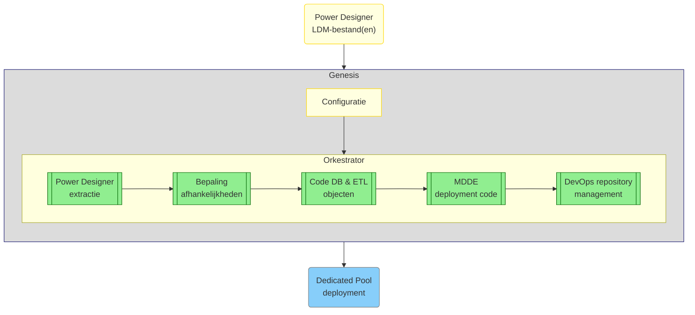

{ align=right width="160" }

# Welkom bij de Genesis documentatie

Genesis is een modulair Python-framework dat Power Designer-modellen omzet naar bruikbare database- en ETL-code. Het helpt data-engineers en modelleurs om complexe datamodellen automatisch te vertalen naar uitvoerbare oplossingen in Azure DevOps.

Dankzij een configureerbare, stap-voor-stap workflow kunnen modeldata worden geëxtraheerd, afhankelijkheden geanalyseerd, deployment-scripts gegenereerd en repositories bijgewerkt — volledig geautomatiseerd en reproduceerbaar.

## Hoe werkt Genesis?

Genesis bestaat uit een reeks samenwerkende componenten die elk een fase in de dataproductieketen ondersteunen: van modelinvoer tot deployment. De volledige workflow wordt georkestreerd vanuit een centrale configuratie. Onderstaande figuur toont het overzicht van de hoofdfasen:



## Voor wie is Genesis?

Genesis is ontwikkeld voor:

* **Data Modellers** die werken met Power Designer-modellen;
* **Data Engineers** die ETL-processen implementeren op basis van deze modellen;
* **DevOps-teams** die verantwoordelijk zijn voor de uitrol van gegenereerde databronnen en pipelines.

## Componenten

### Orkestrator

Het startpunt voor de "Genesis" is de workflow-orkestrator waar alle andere belangrijke componenten samenkomen. De voornaamste functie is het beheren en uitvoeren van de stappen die in de configuratie zijn gedefinieerd, mogelijk inclusief uitrol-stappen. Meer informatie over dit proces is te vinden op de [Orkestrator-pagina](Orkestrator.md).

#### Configuratie

De Orkestrator-flow wordt bepaald door een configuratiebestand. Meer informatie over configuratiebestanden en de methodes waarmee deze worden ingelezen en geverifieerd is te vinden op de [Configuratie-pagina](Configuration.md)

### Power Designer extractie

De Extractor neemt een Power Designer-logisch datamodeldocument (herkenbaar aan de extensie .ldm) en extraheert model- en mapping-relevante informatie in een JSON-bestand (vaak aangeduid als een RETW-bestand). Meer informatie over dit proces is te vinden op de [Extractor-pagina](Extractor.md).

### Bepaling afhankelijkheden

Deze component biedt inzicht in het netwerk van entiteiten en mappings, op basis van RETW-outputbestanden, om te bepalen:

* wat de juiste volgorde is van mappings in de ETL-flow en of de ETL-flow geen gesloten lussen bevat (ETL-flows moeten [acyclisch](https://nl.wikipedia.org/wiki/Gerichte_acyclische_graaf) zijn),
* wat de gevolgen zijn van een mislukte stap in het ETL-proces en
* wat de afhankelijkheden zijn tussen RETW-bestanden voor entiteiten.

Meer informatie is te vinden op de pagina [Afhankelijkheidscontrole](Dependency_checker.md).

### Generator code DB objecten

De Generator gebruikt de output van de Extractor om code te genereren die database objecten kan aanmaken en ETL-processen kan implementeren. Meer informatie hierover is te vinden op de [Generator-pagina](Generator.md).

### Generator MDDE deployment code

De MDDE Deployment zorgt ervoor dat de ETL processen in een pipeline kunnen worden gezet voor de ETL orchestratie. Meer informatie hierover is te vinden op de [Deployment MDDE-pagina](Deploy_MDDE.md).

### DevOps repository management

De Repository Handler plaatst de gegenereerde code automatisch in een DevOps-repository, zodat deze kan worden uitgerold in een Azure-omgeving. Meer informatie hierover is te vinden op de [Repository management-pagina](Repository_Manager.md).

## Hulpprogramma’s

Genesis bevat daarnaast handige tools voor Data Modellers en Data Engineers om:

* de [impact van wijzigingen](Dependency_checker.md) te bepalen;
* [afhankelijkheden tussen Power Designer-documenten](Dependency_checker.md) te analyseren;
* met behulp van de [Logger](Logtools.md) automatisch issues vast te leggen in modellen en mappings;
* met [Documentatie generatie](Documentation_Creation.md) Markdown-bestanden en docstrings om te zetten in leesbare documentatiepagina’s.

## Project folderstructuur

```bash
etl_templates
├───docs  # Source voor documentatie
├───input # Placeholder voor Power Designer documenten
├───site  # Gegenereerde HTML documentatie (niet aanwezig in repo).
└───src
    ├───dependencies_checker   # Bepaling afhankelijkheden
    ├───deploy_mdde            # MDDE deployment code
    ├───generator              # Code DB objecten
    ├───genesis
    |      ├───config_file.py  # Configuratie lezen
    |      ├───main.py         # Start-script Genesis
    |      └───orchestrator.py # Orkestrator
    ├───logtools               # Logging en issue tracking
    ├───pd_extractor           # Power Designer extractie
    └───repository_manager     # DevOps repository management
```
