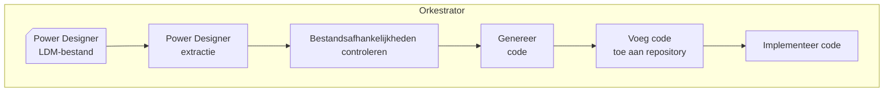

{ align=right width="160" }

# Welkom bij de Genesis documentatie

## Wat is Genesis?

Genesis is een programma dat het mogelijk maakt om Power Designer-logische datamodeldocumenten om te zetten in code die tabellen genereert en ETL-programma’s om die tabellen te vullen. Om dit doel te bereiken doorloopt Genesis een aantal stappen:



## Belangrijke componenten

### Orkestrator

Het startpunt voor de "Genesis" is de workflow-orkestrator waar alle andere belangrijke componenten samenkomen. De voornaamste functie is het beheren en uitvoeren van de stappen die in de configuratie zijn gedefinieerd, mogelijk inclusief uitrol-stappen. Meer informatie over dit proces is te vinden op de [Orkestrator-pagina](Orkestrator.md).

### Extractor

De Extractor neemt een Power Designer-logisch datamodeldocument (herkenbaar aan de extensie .ldm) en extraheert model- en mapping-relevante informatie in een JSON-bestand (vaak aangeduid als een RETW-bestand). Meer informatie over dit proces is te vinden op de [Extractor-pagina](Extractor.md).

### Afhankelijkheidscontrole

Deze component biedt inzicht in het netwerk van entiteiten en mappings, op basis van RETW-outputbestanden, om te bepalen:

* wat de juiste volgorde is van mappings in de ETL-flow en of de ETL-flow geen gesloten lussen bevat (ETL-flows moeten [acyclisch](https://nl.wikipedia.org/wiki/Gerichte_acyclische_graaf) zijn),
* wat de gevolgen zijn van een mislukte stap in het ETL-proces en
* wat de afhankelijkheden zijn tussen RETW-bestanden voor entiteiten.

Meer informatie is te vinden op de pagina [Afhankelijkheidscontrole](Dependency_checker.md).

### Generator

De Generator gebruikt de output van de Extractor om code te genereren die tabellen kan aanmaken en ETL-processen kan implementeren. Meer informatie hierover is te vinden op de [Generator-pagina](Generator.md).

## Hulpprogramma’s

Naast de kernfunctionaliteit heeft Genesis ook enkele hulpmiddelen voor Data Modellers en Data Engineers om:

* de [impact van wijzigingen te bepalen](Dependency_checker.md) die op het punt staan te worden doorgevoerd,
* [afhankelijkheden tussen Power Designer-documenten op te sporen](Dependency_checker.md).
* [Logger](Logtools.md) die naast reguliere logging ook issues vastlegt in de modellen en mappings deze gebruikt kan worden voor de Genesis flow en om de modelleurs op de hoogte te stellen van deze issues.
* [Documentatie generatie](Documentation_Creation.md) waarmee Markdown bestanden en [DocStrings](https://en.wikipedia.org/wiki/Docstring) in de code omgezet kan worden tot documentatiepagina's (die je hier leest).

## Project mappenstructuur

```md
etl_templates
├───docs
├───input
├───site                        # Gegenereerde HTML documentatie. Deze directory is niet aanwezig in het repository maar wordt aangemaakt
└───src
    ├───dependencies_checker
    ├───generator
    ├───genesis
    ├───logtools
    ├───log_config              # Oude logger, moet nog aanwezig zijn indien code nod gebruik maakt van de oude
    └───pd_extractor
```
