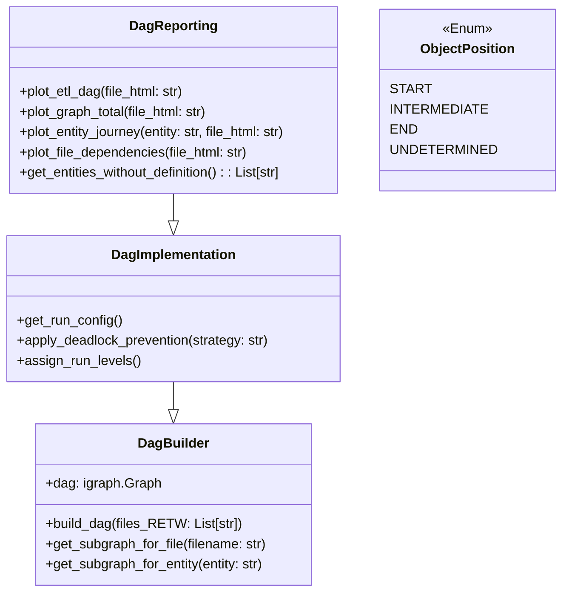

# Integrator voor DAG ETL en Rapportage

## Overzicht

De **`integrator`**-package biedt een modulaire en uitbreidbare set Python-componenten voor het modelleren, analyseren, implementeren en visualiseren van **ETL-workflows** op basis van **Directed Acyclic Graphs (DAG’s)**. Deze workflows worden gedefinieerd aan de hand van RETW JSON-bestanden, waarin de afhankelijkheden tussen databronnen, mappings en modellen beschreven zijn.

De kernfunctionaliteit van de package is verdeeld over drie klassen:

- **`DagBuilder`**: Verantwoordelijk voor het bouwen van de structuur van de ETL-DAG.
- **`DagImplementation`**: Breidt deze structuur uit met uitvoeringslogica, zoals run-levels en deadlock-preventie.
- **`DagReporting`**: Voegt visualisatie- en rapportagemogelijkheden toe.

Deze modulaire opbouw maakt het mogelijk om de componenten afzonderlijk of in combinatie te gebruiken binnen grotere data-integratiesystemen of CI/CD pipelines.

---

## Belangrijkste Klassen en Functionaliteiten

### `DagBuilder`

- **Doel**: Opbouwen en beheren van de ruwe DAG op basis van inputbestanden.
- **Functionaliteiten**:
  - Inlezen van één of meerdere RETW-bestanden.
  - Parseren van modellen, mappings en entiteiten.
  - Genereren van een `igraph.Graph` met knopen en randen die respectievelijk objecten en afhankelijkheden representeren.
  - Genereert unieke en stabiele knoop-ID’s op basis van MD5-hashing.
  - Ondersteuning voor subgraaf-extractie:
    - Per bestand
    - Per entiteit
    - Op basis van mappings
  - Annotatie van knopen met statistieken zoals ETL-levels en run-levels.
  - Detectie van inconsistente of onvolledige flows via foutmeldingen en logging.

### `DagImplementation`

- **Doel**: Toevoegen van uitvoeringslogica aan de basis-DAG.
- **Functionaliteiten**:
  - Bepalen van de juiste uitvoeringsvolgorde van mappings, afhankelijk van gekozen deadlock-preventiestrategie (`SOURCE` of `TARGET`).
  - Groeperen van mappings in stages voor veilige en efficiënte parallelle uitvoering.
  - Detecteren van conflicten tussen mappings op basis van gedeelde entiteiten.
  - Bieden van een gesorteerde `run config` die klaar is voor deployment of schedulers.
  - Mogelijkheid tot uitbreiden met aangepaste strategieën voor conflictoplossing.

### `DagReporting`

- **Doel**: Verhogen van inzicht en traceerbaarheid door middel van visualisatie.
- **Functionaliteiten**:
  - Instellen van visuele attributen per knoop: kleur, vorm, hiërarchie, tooltip.
  - Classificatie van knopen op basis van positie in de flow (`START`, `INTERMEDIATE`, `END`).
  - Conversie van `igraph.Graph` naar `networkx.DiGraph` en export naar HTML via `pyvis`.
  - Vooraf gedefinieerde visualisaties:
    - Volledige DAG (alle objecten)
    - Per bestand
    - Afhankelijkheden tussen bestanden
    - Entiteitstrajecten (de volledige stroom voor een bepaalde entiteit)
    - De pure ETL-flow (entiteiten en mappings zonder bestandseenheden)
  - Detectie van ontbrekende entiteitsdefinities in bestanden.

---

## Visualisatie

De visualisatiecomponent maakt gebruik van `pyvis` in combinatie met `networkx` om interactieve HTML-bestanden te genereren. Visualisaties bieden:
- **Zoom & pan-functionaliteit**
- **Klikbare knopen met tooltips**
- **Hiërarchische lay-out op basis van uitvoeringsvolgorde**
- **Visuele onderscheidingen tussen types (bestand, entiteit, mapping)**

Deze bestanden kunnen lokaal of via een webserver geopend worden en zijn geschikt voor analyses, presentaties of documentatie.

---

## Voorbeeldgebruik

```python
from integrator.dag_reporting import DagReporting

# Bouw en visualiseer de ETL-DAG
dag = DagReporting()
dag.build_dag(files_RETW=["retw/model1.json", "retw/model2.json"])
dag.plot_etl_dag(file_html="docs/output/etl_dag.html")
```

---

## Belangrijke Concepten

| Begrip               | Uitleg                                                                 |
|----------------------|------------------------------------------------------------------------|
| **RETW-bestand**     | JSON-bestand met entiteiten, mappings en modelinformatie               |
| **Entiteit**         | Een knoop die een data-object (bijv. tabel) voorstelt                  |
| **Mapping**          | Een knoop die een transformatie of relatie tussen entiteiten beschrijft|
| **Bestand**          | Relevante RETW-file waaruit entiteiten/mappings zijn afgeleid          |
| **Run-level**        | Uitvoeringsniveau op basis van afhankelijkheden tussen mappings        |
| **ETL-level**        | Abstractieniveau binnen de pijplijn, onafhankelijk van uitvoeringsfase |
| **Deadlock-preventie** | Mechanisme om conflicterende afhankelijkheden te vermijden            |

---

## Foutafhandeling

De module maakt gebruik van aangepaste exceptions voor robuuste foutafhandeling:

- `ErrorDagNotBuilt`: Wordt opgegooid wanneer operaties op een niet-gebouwde DAG worden uitgevoerd.
- `NoFlowError`: Treedt op bij het ontbreken van een geldige flow in de graaf.
- `InvalidDeadlockPrevention`: Voor ongeldige strategieën voor deadlock-preventie.

Fouten worden gelogd via een centrale logger (`logtools.get_logger()`), wat integratie met andere monitoring- of CI-systemen vereenvoudigt.

---

## Extensiepunten

De package is ontworpen voor uitbreiding:

- **Custom visualisaties**: Subclass `DagReporting` en voeg eigen `plot_*` methodes toe.
- **Alternatieve flows**: Breid `DagImplementation` uit voor andere conflictstrategieën of optimalisatietechnieken.
- **Extra metadata**: Voeg extra knoop- of randattributen toe binnen `DagBuilder`.

---

## Afhankelijkheden

| Package     | Doel                                                              |
|-------------|-------------------------------------------------------------------|
| [`igraph`](https://igraph.org/python/)   | Bouwen en analyseren van DAG's op basis van knopen en randen           |
| [`networkx`](https://networkx.org/)     | Compatibiliteitslaag met visualisatietools zoals `pyvis`               |
| [`pyvis`](https://pyvis.readthedocs.io/) | HTML-visualisatie van netwerkstructuren                                |
| [`jinja2`](https://jinja.palletsprojects.com/) | Template-engine voor eventueel HTML- of configgeneratie                |
| `logtools`  | Loggingfunctionaliteit (interne of externe module, afhankelijk van setup) |

## Klassendiagram


